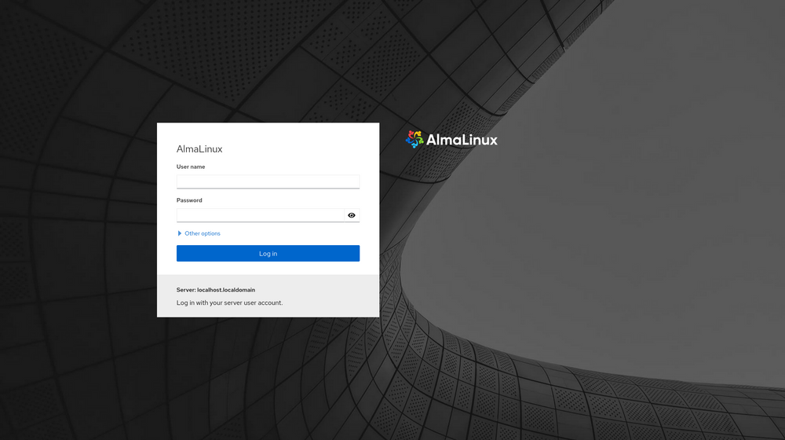
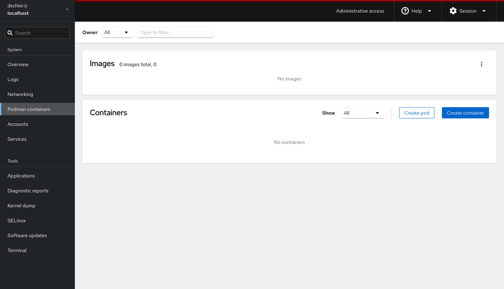

# Podman Setup

Podman is a container engine that allows you to create and manage containers. It is a lightweight and easy-to-use
container runtime that is based on the OCI (Open Container Initiative) specification. It is a popular choice for
developers and system administrators who want to manage containers without the overhead of Docker. Podman is a rootless
container runtime, which means that it does not require root privileges to run containers.

## Installation

Follow official documentation to get detailed steps on how to install podman across various platforms[[1]](#reference).

For simplicity, this article explains installing `podman` in `wsl` and `cockpit` as a web UI for
`podman`[[2]](#reference).

### Install wsl

- Install wsl in windows using the below command.

  ```bash
  wsl --install
  ```

- Update wsl in windows using the below command.

  ```bash
  wsl --update
  ```

- The above commands automatically installs `Ubuntu` distribution in wsl. If not install `Ubuntu` distribution in wsl.

- To find the list of available distributions in wsl, run the below command.

  ```bash
  wsl --list --verbose
  ```

- Set the default distribution to `Ubuntu` in wsl using the below command.

  ```bash
  wsl --set-default Ubuntu
  ```

### Install podman

- Open `Ubuntu` in wsl.

  ```bash
  wsl -d Ubuntu
  ```

- Update packages in wsl using the below command.

  ```bash
  sudo apt update
  ```

- Install podman in wsl using the below command.

  ```bash
  sudo apt install podman -y
  ```

- Start podman socket using the below command.

  ```bash
  sudo systemctl enable --now podman.socket
  ```

  `enable` makes the service start automatically when the system starts and `now` starts the service now.

### Install cockpit

- Open `Ubuntu` in wsl.

  ```bash
  wsl -d Ubuntu
  ```

- Install cockpit in wsl using the below command.

  ```bash
  sudo apt install cockpit cockpit-podman -y
  ```

- Start cockpit server using the below command.

  ```bash
  sudo systemctl enable --now cockpit.socket
  ```

- To check the status of the cockpit server, run the below command.

  ```bash
  sudo systemctl status cockpit.socket
  ```

- Once the server is started, you can access the cockpit web UI using the below URL. `https://<ip>:9090/`. Replace
  `<ip>` with the IP address of your system. The default port is `9090`. The ip address can be found using the following
  command inside wsl `hostname -I`.

- WSL distribution's `name` and `password` can be used to login to the cockpit web UI. Inside cockpit web UI, you can
  find the `podman container`.

  
  

## Install and Run Portainer

- Open `Ubuntu` in wsl.

  ```bash
  wsl -d Ubuntu
  ```

- Enable podman socket

  ```bas
  systemctl enable --now podman.socket
  ```

- Create the volume that Portainer Server will use to store its database

  ```bash
  sudo podman volume create portainer_data
  ```

- Download and install the Portainer Server container

  ```bash
  sudo podman run -d -p 8000:8000 -p 9443:9443 --name portainer --restart=always --privileged -v /run/podman/podman.sock:/var/run/docker.sock -v portainer_data:/data docker.io/portainer/portainer-ce:lts
  ```

- Once the container is up and running, you can access the Portainer web UI using the below URL.
  `https://localhost:9443/`.

:::note

- Used `sudo` or `root` privileges because `podman` is a rootless container runtime.
- First time portainer login will ask for `username` and `password`. Use `admin` as the `username` and `password`.

:::

## Reference

- [1][Podman Installation](https://podman.io/docs/installation)
- [2][Podman + Cockpit](https://blog.while-true-do.io/podman-web-ui-via-cockpit/)
- [3][Podman + Portainer](https://docs.portainer.io/start/install-ce/server/podman/linux)
