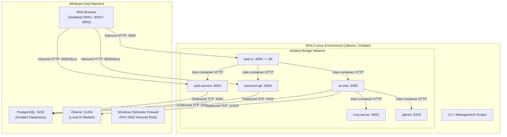
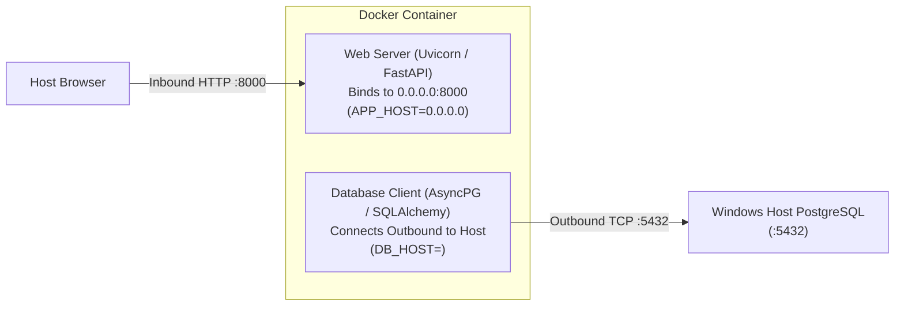

# Hybrid Architecture: WSL2, Docker & Windows Host Database

This guide documents the architecture and deployment strategy for running **containerized microservices inside WSL2 (Ubuntu/Debian)** communicating with **stateful databases (PostgreSQL, Ollama) on the Windows host machine**.

---

## 1. Deployment Architecture

This pattern utilizes an **"inside-out" local architecture**:

* **Stateless Microservices (WSL2 Docker):** Application servers, APIs, background workers, and vector stores run in an isolated container bridge network.
* **Stateful Data & Hardware Inference (Windows Host):** PostgreSQL databases (financial records, user accounts, application checkpoints) and local Ollama model inference run directly on the Windows host for performance, data durability, and simplified backups.



---

## 2. Inbound Server Bind vs. Outbound Database Connection

A critical architectural distinction when configuring container environment variables across the WSL2/Windows boundary:



* **`APP_HOST=0.0.0.0`:** Instructs the container web server to listen on all internal container interfaces for incoming traffic forwarded from the host port mapping (`8000:8000`).
* **`DB_HOST=<GATEWAY_IP>`:** Directs the container database client to the exact IP address of the Windows Host machine where PostgreSQL is listening.

---

## 3. Configuring Windows Host PostgreSQL for WSL2 Access

By default, PostgreSQL on Windows only listens on `localhost` (`127.0.0.1`), rejecting connections from the WSL virtual network.

### 3.1. Enable External Listening in `postgresql.conf`

1. Open `postgresql.conf` (located in `C:\Program Files\PostgreSQL\<version>\data\postgresql.conf`).
2. Update the `listen_addresses` directive:
   ```ini
   listen_addresses = '*'
   ```

### 3.2. Allow WSL Subnet Access in `pg_hba.conf`

1. Open `pg_hba.conf` in the same directory.
2. Add this entry to the bottom:
   ```text
   # Allow WSL2 and Docker container bridge connections
   host    all             all             0.0.0.0/0               scram-sha-256
   ```

### 3.3. Restart PostgreSQL & Add Windows Firewall Rule

Open **PowerShell as Administrator on Windows**:

```powershell
# 1. Restart PostgreSQL service
Restart-Service postgresql*

# 2. Add Windows Defender Firewall rule for PostgreSQL port 5432
New-NetFirewallRule -DisplayName "PostgreSQL for WSL" -Direction Inbound -LocalPort 5432 -Protocol TCP -Action Allow
```

### 3.4. Determining the Host Gateway IP

In WSL, retrieve the Windows host gateway IP:

```bash
ip route show default | awk '{print $3}'
```

Verify connectivity from WSL:

```bash
nc -zv <GATEWAY_IP> 5432
# Expected: Connection to <GATEWAY_IP> 5432 port [tcp/postgresql] succeeded!
```

> [!NOTE]
> Do not use `10.255.255.254`. That address is WSL2's internal DNS tunneling resolver, not the Windows host TCP interface. Always use the gateway IP from `ip route show default`.

---

## 4. Summary of Key Lessons

1. **Host-bound services must bind to `0.0.0.0`** on Windows if they need to accept requests from WSL2 or Docker containers.
2. **Container services must bind to `0.0.0.0`** inside their container so port forwards (`-p 8000:8000`) reach the application server.
3. **Firewall rules on Windows are mandatory** when connecting across the virtual switch to port 5432 (PostgreSQL) or port 11434 (Ollama).

