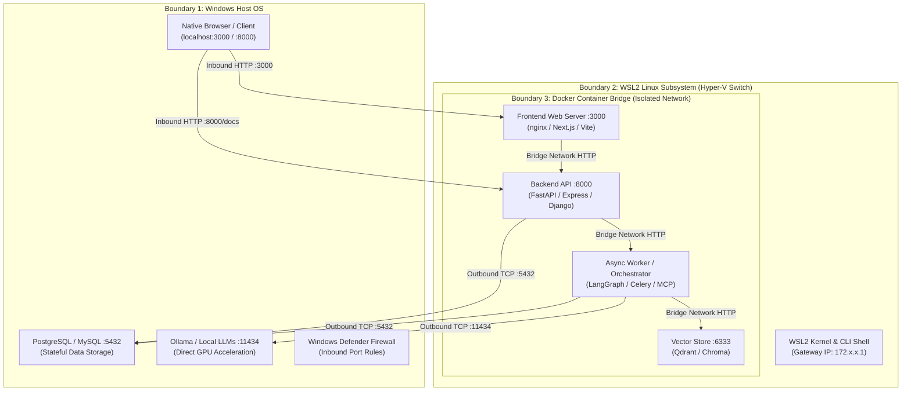
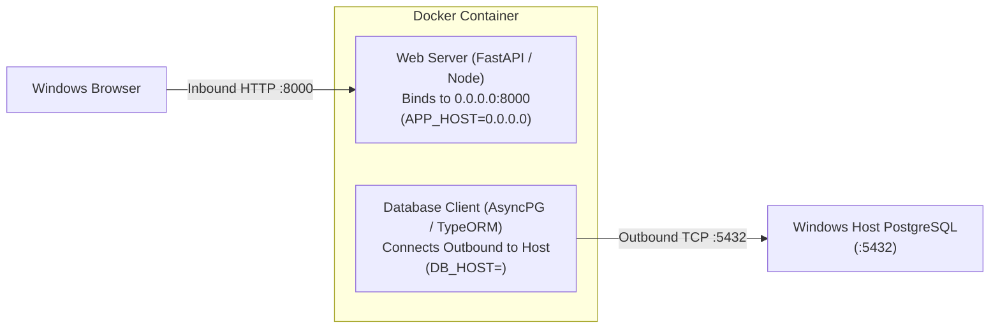

# Hybrid Local Architecture: WSL2, Docker & Windows Host Services

This guide provides a comprehensive, repository-agnostic blueprint for configuring an **"inside-out" local development environment**. In this architecture, stateless application workloads, microservices, and background workers run inside **Docker containers on WSL2 (Windows Subsystem for Linux)**, while stateful databases (PostgreSQL, MySQL, Redis) and hardware-accelerated services (Ollama, local LLMs) run directly on the **Windows host machine**.

---

## 1. Architectural Overview & Design Pattern

### Why the Inside-Out Pattern?

When developing modern cloud-native applications on Windows, developers often encounter trade-offs between filesystem performance, Linux tool compatibility, and database persistence:

* **Linux-Native Tooling:** Running development tools, Python/Node runtime environments, and container engines directly in WSL2 delivers native POSIX filesystem speeds and Linux CLI parity.
* **Host-Managed Persistence:** Running databases directly on Windows simplifies data backups, survives WSL distribution resets, avoids virtual disk expansion bloat (`ext4.vhdx`), and allows direct GUI management through native Windows tools (pgAdmin, DBeaver).
* **Hardware Acceleration:** Native Windows installations of AI runtimes (like Ollama) have direct, zero-overhead access to host GPU drivers (CUDA, DirectML) without complex passthrough configurations.



---

## 2. Phase 1: Windows & WSL2 Installation & Tuning

### 2.1. Enable Windows Subsystem for Linux & Virtual Machine Platform

Open **PowerShell as Administrator on Windows**:

```powershell
# Enable WSL and Virtual Machine Platform
dism.exe /online /enable-feature /featurename:Microsoft-Windows-Subsystem-Linux /all /norestart
dism.exe /online /enable-feature /featurename:VirtualMachinePlatform /all /norestart

# Set WSL default version to 2
wsl --set-default-version 2

# Install Ubuntu (or your preferred distribution)
wsl --install -d Ubuntu-24.04
```

Restart your computer if prompted by Windows.

### 2.2. Configure Performance Limits via `.wslconfig`

To prevent WSL2 from consuming all available host RAM and CPU threads, create or edit `%USERPROFILE%\.wslconfig` in Windows:

```ini
[wsl2]
# Limit memory allocation (adjust based on host RAM, e.g., 8GB or 16GB)
memory=12GB

# Assign logical processor cores
processors=6

# Set swap memory space
swap=4GB

# Enable automatic localhost port forwarding from Windows to WSL2
localhostForwarding=true

[experimental]
autoMemoryReclaim=gradual
sparseVhd=true
```

### 2.3. Enable `systemd` in WSL2

Inside your WSL2 terminal, configure `/etc/wsl.conf` so services like Docker and cron can be managed via `systemctl`:

```bash
sudo bash -c 'cat <<EOF > /etc/wsl.conf
[boot]
systemd=true

[network]
generateResolvConf=true
EOF'
```

Restart the distribution from PowerShell (`wsl --shutdown`) and reopen WSL.

---

## 3. Phase 2: Installing Native Docker CE in WSL2

Running native **Docker Community Edition (CE)** inside WSL2 eliminates the overhead and licensing restrictions of desktop GUI wrappers.

### 3.1. Install Docker Engine & Compose Plugin

Run the following commands inside your WSL2 terminal:

```bash
# 1. Update package index and install prerequisite certificates
sudo apt-get update
sudo apt-get install -y ca-certificates curl gnupg lsb-release netcat-openbsd

# 2. Add Docker official GPG key
sudo install -m 0755 -d /etc/apt/keyrings
curl -fsSL https://download.docker.com/linux/ubuntu/gpg | sudo gpg --dearmor -o /etc/apt/keyrings/docker.gpg
sudo chmod a+r /etc/apt/keyrings/docker.gpg

# 3. Add repository to Apt sources
echo \
  "deb [arch=$(dpkg --print-architecture) signed-by=/etc/apt/keyrings/docker.gpg] https://download.docker.com/linux/ubuntu \
  $(lsb_release -cs) stable" | sudo tee /etc/apt/sources.list.d/docker.list > /dev/null

# 4. Install Docker Engine and Docker Compose Plugin
sudo apt-get update
sudo apt-get install -y docker-ce docker-ce-cli containerd.io docker-buildx-plugin docker-compose-plugin
```

### 3.2. Configure Non-Root Permissions

Allow your normal Linux user account to execute Docker commands without `sudo`:

```bash
sudo usermod -aG docker $USER
newgrp docker
```

Verify the installation:

```bash
docker compose version
docker run --rm hello-world
```

---

## 4. Phase 3: Cross-Boundary Networking Mechanics

Understanding how packets traverse the boundaries between Windows, WSL2, and Docker containers is vital for reliable configurations.

### 4.1. The 3 Network Boundaries

1. **Windows Host OS (`127.0.0.1` / Local Physical Interfaces):** The parent operating system hosting physical hardware drivers and host services.
2. **WSL2 Virtual Switch (`172.x.x.x`):** An internal Hyper-V virtual network adapter connecting Windows and WSL2.
3. **Docker Bridge Network (`172.18.x.x`):** An isolated Linux bridge created by Docker inside WSL2 for inter-container communication.

```
┌─────────────────────────────────────────────────────────────┐
│ Windows Host (127.0.0.1 / Physical LAN)                     │
│   ▲                                                         │
│   │ Windows Hyper-V Virtual Ethernet Adapter                │
│   ▼                                                         │
│ WSL2 Linux Subsystem (Gateway: e.g., 172.28.160.1)          │
│   ▲                                                         │
│   │ docker0 / user-defined bridge network                   │
│   ▼                                                         │
│ Docker Containers (e.g., 172.18.0.2, 172.18.0.3)            │
└─────────────────────────────────────────────────────────────┘
```

### 4.2. Inbound Binding (`0.0.0.0`) vs Outbound Database Connection (`<HOST_IP>`)

A frequent source of configuration confusion in containerized development:



* **Server Binding (`0.0.0.0`):** Inside the container, servers must listen on `0.0.0.0` (all interfaces) rather than `127.0.0.1` so incoming requests forwarded through Docker port mappings (`-p 8000:8000`) are accepted.
* **Client Connections (`<HOST_GATEWAY_IP>`):** From inside a container, `127.0.0.1` refers to the container itself, and `localhost` does not resolve to Windows. Outbound database clients must connect to the **Windows Host Gateway IP**.

### 4.3. Determining the Windows Host Gateway IP Dynamically

In WSL2, the default route points directly to the Windows Host virtual switch interface:

```bash
# Retrieve Host Gateway IP from default route
ip route show default | awk '{print $3}'
```

> [!CAUTION]
> **The DNS Stub Trap (`10.255.255.254`):**
> When WSL2 DNS tunneling is active, `/etc/resolv.conf` may list `nameserver 10.255.255.254`. This address is a DNS resolver stub, **not** the host TCP interface. Do not use `10.255.255.254` for database connections. Always use the gateway IP retrieved from `ip route show default`.

---

## 5. Phase 4: Configuring Windows Host Services

To allow connections originating from the WSL2 virtual switch, host services must accept traffic on external interfaces and Windows Firewall rules must be active.

### 5.1. PostgreSQL Host Configuration

1. **Configure External Listener (`postgresql.conf`):**
   Open `postgresql.conf` on Windows (e.g., `C:\Program Files\PostgreSQL\<version>\data\postgresql.conf`) and update:
   ```ini
   listen_addresses = '*'
   ```

2. **Allow WSL Subnet Authentication (`pg_hba.conf`):**
   Open `pg_hba.conf` in the same directory and append to the bottom:
   ```text
   # Allow incoming connections from WSL2 and Docker container bridges
   host    all             all             0.0.0.0/0               scram-sha-256
   ```
   *(If using legacy md5 password hashing, substitute `md5` for `scram-sha-256`).*

3. **Restart PostgreSQL Service (PowerShell Admin):**
   ```powershell
   Restart-Service postgresql*
   ```

### 5.2. Ollama Local AI Configuration (Optional)

If running local LLM inference via Ollama on Windows:

1. Set the system environment variable on Windows:
   ```text
   OLLAMA_HOST=0.0.0.0:11434
   ```
2. Restart the Ollama application.

### 5.3. Configure Windows Defender Firewall Rules

By default, Windows Defender Firewall blocks inbound connections originating from virtual switch subnets. Open **PowerShell as Administrator on Windows**:

```powershell
# Allow inbound TCP on PostgreSQL port 5432
New-NetFirewallRule -DisplayName "PostgreSQL for WSL" -Direction Inbound -LocalPort 5432 -Protocol TCP -Action Allow

# Allow inbound TCP on Ollama port 11434 (if used)
New-NetFirewallRule -DisplayName "Ollama for WSL" -Direction Inbound -LocalPort 11434 -Protocol TCP -Action Allow
```

---

## 6. Phase 5: Universal Docker Compose Pattern & Automation

Below is a reusable, repository-agnostic template demonstrating how to connect containerized services to host-managed databases.

### 6.1. Generic `docker-compose.yml`

```yaml
services:
  api:
    build:
      context: .
      dockerfile: Dockerfile
    container_name: app-backend-api
    restart: unless-stopped
    ports:
      - "8000:8000"
    environment:
      # Server binds to all interfaces inside container
      - SERVER_HOST=0.0.0.0
      - SERVER_PORT=8000
      # Database connection routes outbound to Windows host
      - DATABASE_URL=postgresql+asyncpg://${DB_USER}:${DB_PASS}@${HOST_GATEWAY_IP}:5432/${DB_NAME}
      - OLLAMA_URL=http://${HOST_GATEWAY_IP}:11434
    networks:
      - app-network

  web:
    image: nginx:alpine
    container_name: app-frontend-proxy
    restart: unless-stopped
    ports:
      - "3000:80"
    depends_on:
      - api
    networks:
      - app-network

networks:
  app-network:
    driver: bridge
```

### 6.2. Automated Environment Setup Script (`setup-env.sh`)

Use this helper script in any repository to automatically detect and export the current host gateway IP into your `.env` file before launching containers:

```bash
#!/usr/bin/env bash
set -euo pipefail

# Determine current Windows Host Gateway IP
GATEWAY_IP=$(ip route show default | awk '{print $3}')

if [ -z "$GATEWAY_IP" ]; then
    echo "Error: Could not determine Windows Host Gateway IP." >&2
    exit 1
fi

echo "Detected Windows Host Gateway IP: ${GATEWAY_IP}"

# Update or inject HOST_GATEWAY_IP into .env
if [ -f .env ]; then
    if grep -q "^HOST_GATEWAY_IP=" .env; then
        sed -i "s/^HOST_GATEWAY_IP=.*/HOST_GATEWAY_IP=${GATEWAY_IP}/" .env
    else
        echo "HOST_GATEWAY_IP=${GATEWAY_IP}" >> .env
    fi
else
    echo "HOST_GATEWAY_IP=${GATEWAY_IP}" > .env
fi

echo "Updated .env with HOST_GATEWAY_IP=${GATEWAY_IP}"
```

Make it executable:

```bash
chmod +x setup-env.sh
```

---

## 7. Phase 6: Connectivity Diagnostics & Verification

### 7.1. Test TCP Port Reachability from WSL2

Verify that the Windows host port is listening and unblocked by the firewall:

```bash
# Test PostgreSQL port (5432)
nc -zv $(ip route show default | awk '{print $3}') 5432
# Expected: Connection to <GATEWAY_IP> 5432 port [tcp/postgresql] succeeded!

# Test Ollama port (11434, if running)
nc -zv $(ip route show default | awk '{print $3}') 11434
# Expected: Connection to <GATEWAY_IP> 11434 port [tcp/*] succeeded!
```

### 7.2. Verify Windows Active Sockets (PowerShell)

```powershell
Get-NetTCPConnection -LocalPort 5432 | Select-Object LocalAddress, LocalPort, State
# Expected LocalAddress: 0.0.0.0 with State: Listen
```

---

## 8. Phase 7: Troubleshooting Matrix

| Symptom                                                                   | Probable Cause                                                         | Resolution                                                                                                                                          |
| :------------------------------------------------------------------------ | :--------------------------------------------------------------------- | :-------------------------------------------------------------------------------------------------------------------------------------------------- |
| `Connection refused` on port 5432                                         | Service is only bound to `127.0.0.1` on Windows                        | Set `listen_addresses = '*'` in `postgresql.conf`, add `0.0.0.0/0` rule in `pg_hba.conf`, and restart service.                                      |
| `Connection timed out` on port 5432                                       | Windows Defender Firewall is dropping packets from the virtual adapter | Execute `New-NetFirewallRule -DisplayName "PostgreSQL for WSL" -Direction Inbound -LocalPort 5432 -Protocol TCP -Action Allow` in PowerShell Admin. |
| `nc: connect to 10.255.255.254 failed: Connection refused`                | Attempted connection to WSL2 DNS resolver stub                         | Use gateway IP from `ip route show default \| awk '{print $3}'`.                                                                                    |
| `permission denied while trying to connect to Docker daemon`              | User not in `docker` Linux group                                       | Run `sudo usermod -aG docker $USER && newgrp docker` in WSL2.                                                                                       |
| Container web server unreachable from Windows browser at `localhost:8000` | Application inside container bound to `127.0.0.1` instead of `0.0.0.0` | Set server bind host to `0.0.0.0` (e.g. `uvicorn main:app --host 0.0.0.0 --port 8000`).                                                             |
| Password authentication failed for database user                          | User role or password mismatch between `.env` and PostgreSQL server    | Verify credentials using `psql -h localhost -U <username> -d <database>`.                                                                           |

---

## 9. Rollback & Teardown Commands

If you need to remove the configuration or reset settings:

```powershell
# Remove Windows Firewall rules (PowerShell Admin):
Remove-NetFirewallRule -DisplayName "PostgreSQL for WSL"
Remove-NetFirewallRule -DisplayName "Ollama for WSL"

# Revert postgresql.conf listener:
# Set listen_addresses = 'localhost' in postgresql.conf and restart:
Restart-Service postgresql*
```
