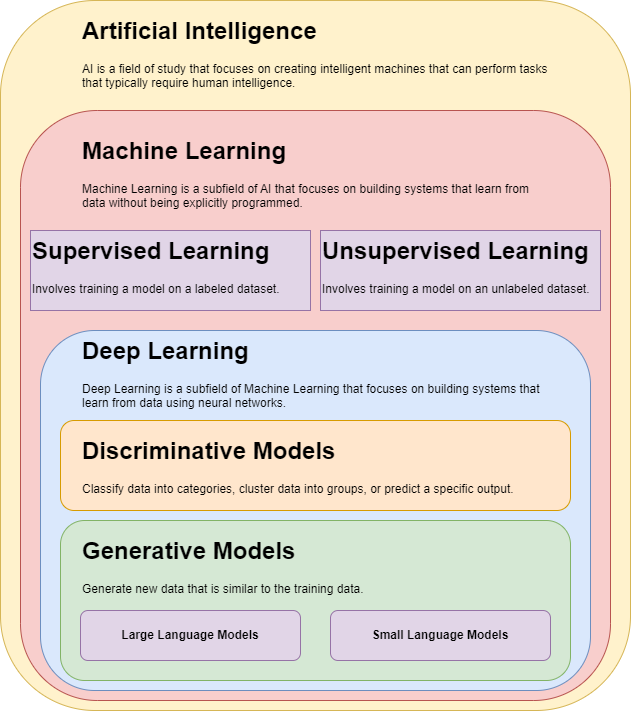
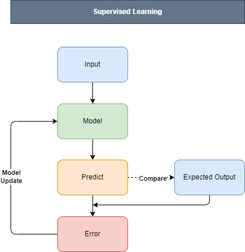
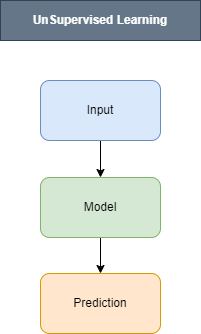
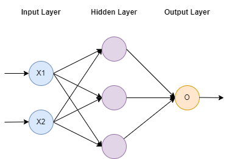

# Basics of GenAI, Machine Learning, and Deep Learning

## Introduction

Artificial Intelligence (AI) is a field of computer science that focuses on creating intelligent machines that can
perform tasks that typically require human intelligence.

The below diagram provides insight on the relationship between AI, Machine Learning, and Deep Learning.

## Machine Learning

Machine Learning is a subfield of AI that focuses on building systems that learn from data without being explicitly
programmed.

### Supervised Learning

Supervised Learning is a type of Machine Learning where the model is trained on a labeled dataset.

- Learning from past examples to make predictions on new data
- Example: Predicting tip amount based on meal cost

### Unsupervised Learning

Unsupervised Learning is a type of Machine Learning where the model is trained on an unlabeled dataset.

- Looking at raw data to find patterns or groupings
- Example: Analyzing employee salary based on the number of years of experience

## Deep Learning

Deep Learning is a subfield of Machine Learning that focuses on building systems that learn from data using neural
networks.

### Discriminative Models

Discriminative Models are a type of Deep Learning model that are used to classify data into different categories.

### Generative Models

Generative Models are a type of Deep Learning model that are used to generate new data that is similar to the training
data.

#### Large Language Models (LLMs)

Large Language Models (LLMs) are a type of Generative Model that are used to generate text, code, and other forms of
natural language.
