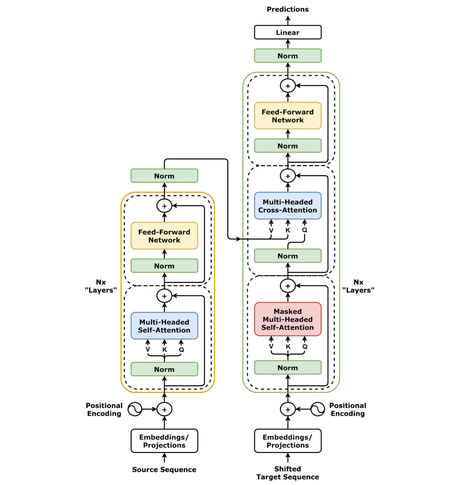
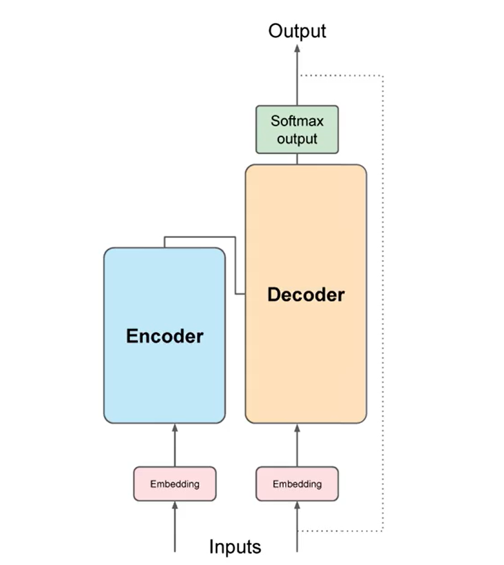
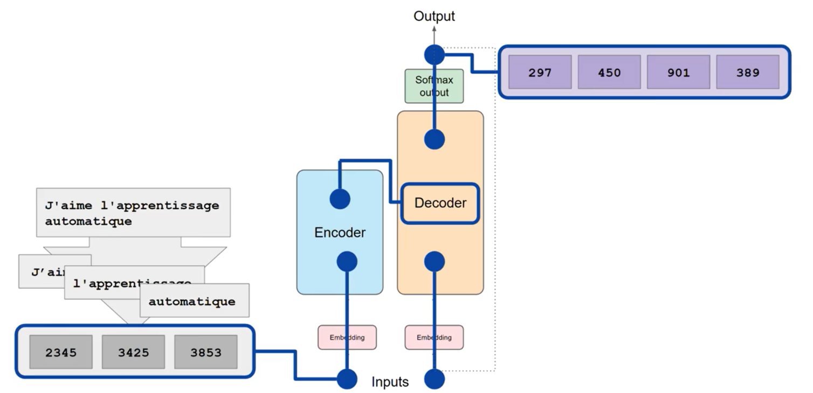

# Transformers

## Introduction

Transformers are a type of neural network architecture used for performing machine learning tasks.

- They are introduced in the paper ***Attention is All You Need*** by Vaswani et al. (2017)
- They were designed to improve the performance of sequence-to-sequence models in natural language processing tasks.
- They overcame the limitations of not being able to capture the dependencies between words in a sentence for RNNs and
  LSTMs.
  - **For example**, in the sentence "John travels to New York and then he goes to Paris", the word "he" refers to
    "John" in the sentence but the traditional models would have a hard time to capture this dependency. This might
    be applicable in larger sentences and in language translation tasks.
  - Also, one word might have multiple meanings depending on the context in which it is used.
- Initially, the model was mainly developed for NLP.

Three main significance of the model are:

- **Positional Encoding**: The model uses positional encoding to encode the position of the words in the sentence.
- **Attention**: The model uses attention to encode the dependencies between the words in the sentence. For example,
  while translating "I love Tamil" to "எனக்கு தமிழ் பிடிக்கும்", the model gives more weight to the word "Tamil" when
  it is attending to the word "தமிழ்" and vice versa. Attention is a broader concept and is not limited to the
  Transformer model.
- **Self-Attention**: The model uses self-attention to encode the dependencies between the words in the same sentence.
  The key difference between self-attention and attention is that in self-attention, the model attends to the words
  in the same sentence. For example, in the sentence "The cat sat on the mat", the model will attend to the words "sat"
  and "mat" when it is attending to the word "cat" since it has more context with the word "cat" and gives less weight
  to the word "the".

## Nomenclature & Abbreviations

| Term                | Definition                                                                        |
| :------------------ | :-------------------------------------------------------------------------------- |
| Attention           | Allows the model to attend to the words in the input sentence.                    |
| Context Window      | Number of tokens that the model can attend to.                                    |
| Decoder             | A component of the Transformer model that decodes the encoded input sentence.     |
| Embedding           | Process of converting a token into a vector.                                      |
| Encoder             | A component of the Transformer model that encodes the input sentence.             |
| Inference           | The process of generating text using models.                                      |
| LSTM                | Long Short-Term Memory                                                            |
| Multi-Head          | Allows the model to attend to different parts of the input sentence.              |
| Positional Encoding | Allows the model to encode the position of the words in the sentence.             |
| RNN                 | Recurrent Neural Network                                                          |
| Self-Attention      | Allows the model to attend to the words in the same sentence.                     |
| Token               | A unit of text in a sentence.                                                     |
| Tokenizer           | A tool that converts a sentence into a sequence of tokens.                        |
| Transformer         | A type of neural network architecture used for performing machine learning tasks. |

## Architecture

The architecture of the Transformer model is shown in the below diagram.

## Transformer Flow

- Considering a translation task.
- The input sentence is tokenized into tokens, using the same tokenizer used to train the model.
- The token are then connected to the input of the encoder.
- Passes through the encoder and fed into the multi-head attention mechanism.
- The output of the multi-head attention mechanism is then passed to the feed-forward network to the output of the
  decoder.
- The data leaving the encoder is the context vector which is used to influence the decoder's output.
- A start of sequence token is added to the input of the decoder.
- This triggers the decoder to generate the next token. This is done based on the context vector from the encoder.
- The output is then finally passed through a softmax layer to get the final output.
- The output is then passed back to the model to generate the next token.
- This process continues until the model generates the end of sequence token.
- The output tokens are then converted back to the original sentence.

## Types of Transformers

- **Encoder-Decoder**: The model has an encoder and a decoder. **For example**, Translation, Summarization, etc.
- **Encoder-Only**: The model has only an encoder. **For example**, Classification.
- **Decoder-Only**: The model has only a decoder. **For example**, Text Generation.

## Reference

- [Attention is All You Need](https://arxiv.org/abs/1706.03762)
- [GeeksforGeeks - Transformers](https://www.geeksforgeeks.org/getting-started-with-transformers/)
