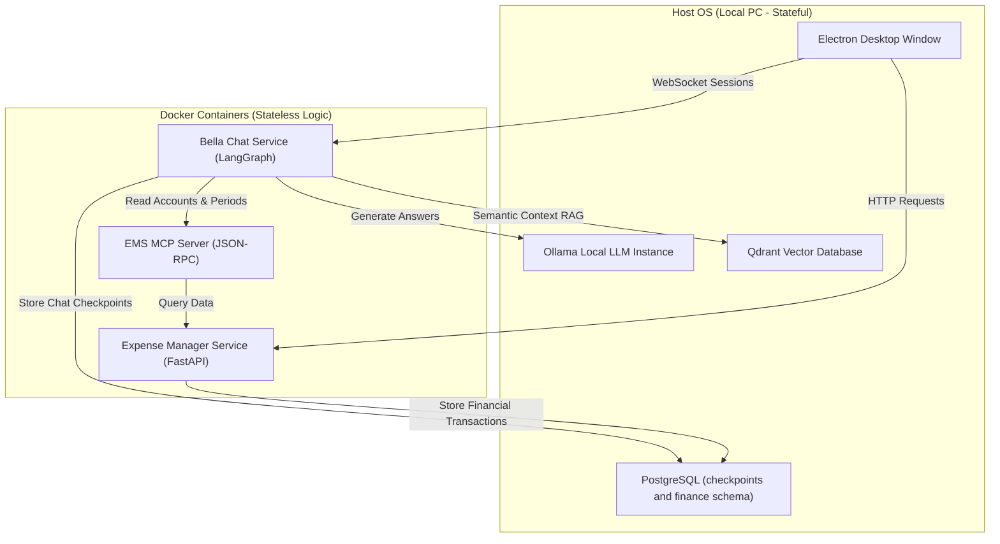

# System Architecture

Bella Keys utilizes a containerized logic layer communicating with native data stores on the host operating system. This separates stateless runtime execution from persistent user databases to preserve local privacy.

---

## Service Boundaries

The following flowchart illustrates the communication paths and runtime boundaries between the desktop environment and the Docker containers:

---

## Network Configurations

To establish network connections between the Docker network namespace and host-bound services, the container configurations map endpoints to the host gateway:

- **PostgreSQL Database Endpoint**: `host.docker.internal:5432`
- **Qdrant Vector Storage Endpoint**: `host.docker.internal:6333`
- **Ollama Engine API Endpoint**: `host.docker.internal:11434`

This architecture allows the Docker containers to remain stateless and easily upgradeable, while all stateful user configurations and financial logs stay safely on the user's host filesystem.
