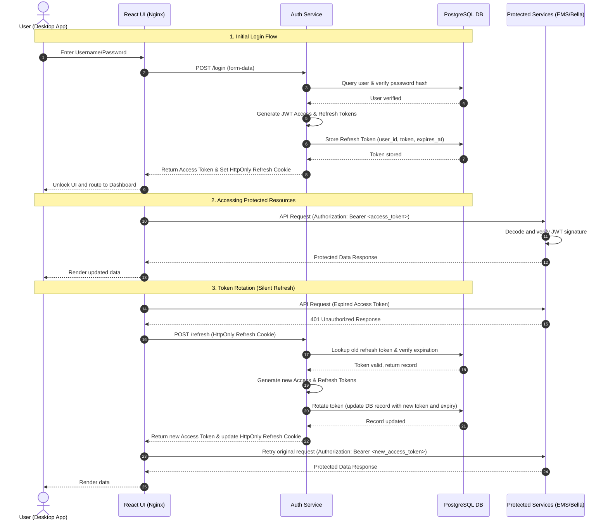

import Tabs from '@theme/Tabs';
import TabItem from '@theme/TabItem';

# Authentication Service

The Authentication Service is a dedicated identity and session management microservice built with FastAPI. It secures all system interactions using JSON Web Tokens (JWT) and HttpOnly session cookies.

---

## Technical Stack

* **Framework**: FastAPI (Python 3.13+) serving JSON endpoints.
* **Database & Persistence**: Asynchronous SQLAlchemy mapping data to PostgreSQL.
* **Cryptography & Hashing**: Secure password hashing via native Python `bcrypt` (avoiding the legacy `passlib` library).
* **Token Operations**: Standard HMAC-SHA256 JWT tokens generated using `python-jose`.

---

## Token Strategy & Security Patterns

To defend against Cross-Site Scripting (XSS) and Cross-Site Request Forgery (CSRF) vulnerabilities, a hybrid token storage strategy is used:

### 1. In-Memory Access Tokens

* **Lifespan**: Short-lived (60 minutes).
* **Storage**: Held strictly in client-side application memory (`tokenStore.ts` in the React UI).
* **Security Rationale**: By keeping the access token in volatile JavaScript memory (rather than `localStorage` or `sessionStorage`), it is shielded from script-based extraction attacks.

### 2. HttpOnly Cookies for Refresh Tokens

* **Lifespan**: Long-lived (7 days).
* **Storage**: Stored in a browser cookie marked as `HttpOnly`, `Secure` (when running over HTTPS), and `SameSite=Lax`.
* **Security Rationale**: Marking the cookie `HttpOnly` prevents browser scripts from reading or stealing the token. The `SameSite` attribute restricts the cookie from being sent on cross-site requests, mitigating CSRF attacks.

### 3. Refresh Token Rotation (RTR)

To prevent unauthorized replay of session tokens:

* On `/refresh` requests, the server validates the current token, issues a **new** access token, generates a **new** refresh token, updates the database, and replaces the client's cookie.
* If a client presents a refresh token that has already been rotated (invalidated), the server flags this as a replay attack and **automatically revokes all active sessions** for that user, requiring credentials re-authentication.

---

## Authentication Flow Diagram

The sequence diagram below illustrates the authentication lifecycle, including user login, accessing protected resources, and token rotation (silent refresh):

---

## Workspace Showcase

The lock screen and registration card manage session access on the desktop client:

### Lock Screen

<Tabs groupId="theme-preference">
  <TabItem value="light" label="Light Theme" default>
    
  </TabItem>
  <TabItem value="dark" label="Dark Theme">
    
  </TabItem>
</Tabs>

### User Registration

<Tabs groupId="theme-preference">
  <TabItem value="light" label="Light Theme" default>
    
  </TabItem>
  <TabItem value="dark" label="Dark Theme">
    
  </TabItem>
</Tabs>
