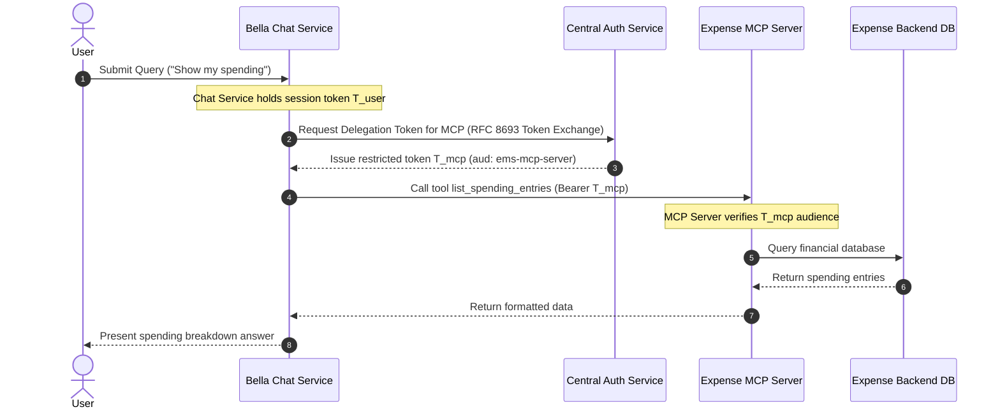

# Permissions, Scopes and AI Delegation

When logging into Bella Keys, the authorization screen presents a list of permissions requested by the application. This document explains what those permissions mean and how the AI Assistant acts on your behalf.

---

## Requested Permissions (Scopes)

| Permission Shown         | Technical Scope    | Description                                                                 |
| ------------------------ | ------------------ | --------------------------------------------------------------------------- |
| **Verify your identity** | `openid`           | Confirms user identity and generates a secure local session.                |
| **Read profile claims**  | `profile`          | Displays username and role within the application interface.                |
| **Read email address**   | `email`            | Associates local profile details with the user context.                     |
| **View expense data**    | `bella-ems:read`   | Grants permission to read spending entries, accounts, and wealth summaries. |
| **Manage expense data**  | `bella-ems:write`  | Grants permission to create, edit, and delete financial records.            |
| **View chat history**    | `bella-chat:read`  | Allows the interface to load past assistant threads and messages.           |
| **Send chat queries**    | `bella-chat:write` | Allows sending queries and executing requests with the AI Assistant.        |

---

## AI Assistant Delegation Architecture

When asking the AI Assistant to perform an action (for example, *"How much was spent on groceries in July?"*):

---

## Security Benefits of On-Behalf-Of Delegation

### Elimination of Master Keys

The AI Assistant does not hold permanent administrative master keys to user data.

### Audience-Restricted Tokens

When Chat Service invokes an external tool server, it exchanges the user token for a single-purpose token (`T_mcp`) restricted strictly to that specific tool server.

### Auditability

Actions executed by AI tools embed an actor delegation claim (`act`) confirming that the request was initiated by the assistant on behalf of the primary user.

### Instant Revocation

Terminating a session invalidates all delegated access tokens immediately.
