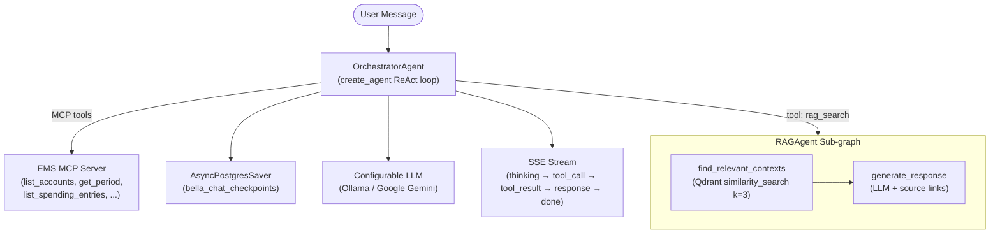

import Tabs from '@theme/Tabs';
import TabItem from '@theme/TabItem';

# Bella Chat Service

The Bella Chat Service is the AI orchestration engine for Bella Keys. It routes user queries to the right tool — financial data via MCP, knowledge search via RAG, or a direct LLM response — and streams the result back token-by-token over SSE.

---

<Tabs>
  <TabItem value="capabilities" label="Capabilities" default>

**Financial Data Access**
Natural language queries against accounts, spending entries, and budgeting periods. Routed to the EMS MCP Server via LLM tool calls.

**Semantic Knowledge Search (RAG)**
Retrieves grounded answers from the personal wiki using Qdrant vector search. Responses include source hyperlinks.

**Persistent Conversation Memory**
Multi-turn sessions are checkpointed to PostgreSQL via `AsyncPostgresSaver`. Conversation history survives Electron window restarts.

**SSE Streaming**
Responses stream token-by-token as `text/event-stream`. Event types: `thinking`, `tool_call`, `tool_result`, `response`, `error`, `done`.

**Configurable LLM Backend**
Supports Ollama (local, default: `qwen2.5vl:7b`) and Google Gemini, switchable via `SYNTHESIS_MODEL_PROVIDER`.

**Observability**
LangChain traces instrumented with Arize Phoenix via `openinference`. Trace data stored in PostgreSQL.

  </TabItem>
  <TabItem value="architecture" label="Architecture">

### OrchestratorAgent

Built with LangGraph's `create_agent` ReAct loop. Receives a user message, decides which tool to call (or answers directly), and iterates until a final response is ready.

### SimpleChatAgent

A lightweight fallback agent for persona-based Q&A when no tool is needed. Single-node graph: `generate_response` only.

### State Persistence

All conversation turns are serialized into `bella_chat_checkpoints` (PostgreSQL) by `AsyncPostgresSaver`. Tables are auto-created on first startup via `checkpointer.setup()`.

  </TabItem>
  <TabItem value="workspace" label="Workspace">

### Session Initialization

The interface starts a new conversation thread and connects to the OrchestratorAgent:

### Verified Retrieval

The RAGAgent returns grounded answers with source citation overlays:

  </TabItem>
</Tabs>
