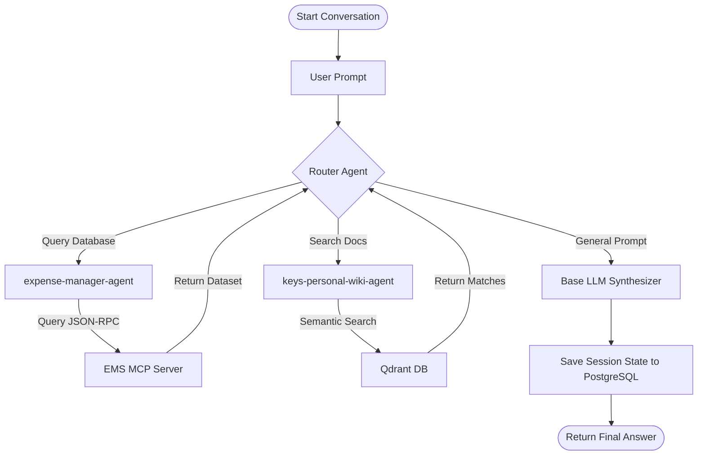

# Chat Service Architecture

The Bella Chat Service coordinates reasoning paths, semantic lookups, and tools using LangGraph workflows.

---

## LangGraph Workflow Routing

Conversations are managed as stateful transition graphs. Based on the classification of the user's intent, the router node directs the pipeline to specialized sub-agents or tool executors:

---

## Agent Definitions

The graph contains two specialized tool-calling agents:

### Expense Manager Agent

- **Purpose**: Interfaces with the database through Model Context Protocol JSON-RPC tool endpoints.
- **Operations**: Interprets natural language queries relating to account listings, budgeting periods, and logged transactions, converting them to valid parameters for execution.

### Personal Wiki Agent

- **Purpose**: Performs semantic retrieval across local text markdown collections.
- **Operations**: Extracts relevance-ranked passage text and context annotations to form the grounded context for RAG generation.

---

## State Persistence

The conversational flow utilizes a centralized state schema:

- **Conversation History**: Every turn is parsed, serialized, and loaded into checkpointers to maintain historical context.
- **PostgreSQL Checkpointer**: Persists the session checkpoints natively on the host database. This enables Electron window restarts to retain active conversation threads.
