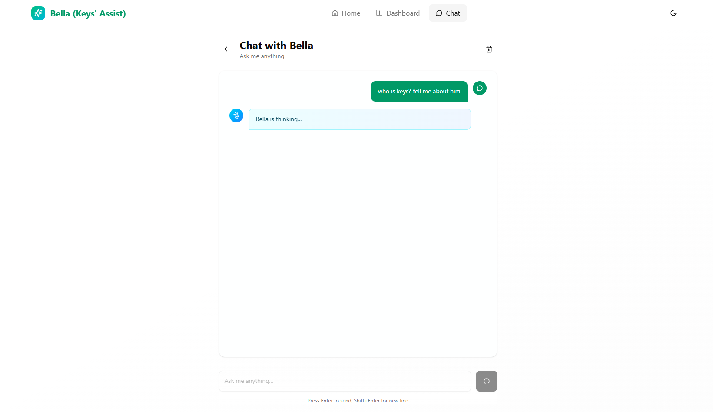
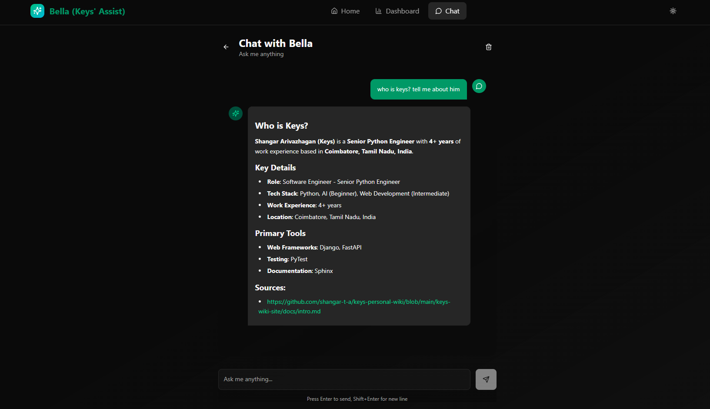

# Bella Chat Service

The Bella Chat Service provides natural language access to local data and assistant functionalities. It allows users to run voice or text queries against their financial records and local documentation.

---

## Capabilities

- **Natural Language Data Access**: Query accounts, transaction summaries, and budget statistics directly.
- **Semantic RAG Inquiries**: Retrieve grounded answers using documentation chunking and vector searches.
- **Session State Control**: Maintains multi-turn conversation logs across desktop client restarts.

---

## Workspace Layout

### Session Initialization

The interface establishes links to the local LangGraph orchestration nodes:

### Verified Retrieval

Retrieves local documentation references with source citation overlays:

