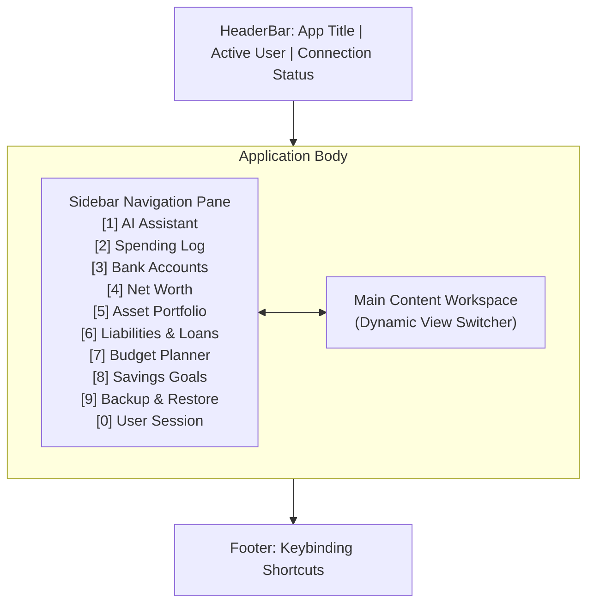

# Bella TUI: Terminal Companion User Guide

`bella` is the interactive terminal companion for Bella Assist. It enables complete access to your financial records, wealth tracking, budget planning, and AI personal assistant directly from your command line without requiring a browser or desktop application.

---

## 1. Quick Installation &amp; Launch

:::info Installing `bella` (Private Repository)
Because `bella-keys-personal-assist` is a private repository, `uv` requires authenticated git access. You can install globally using any of the following methods:

**Method 1: Direct install via SSH (Recommended)**
```bash
uv tool install "git+ssh://git@github.com/shangar-t-a/bella-keys-personal-assist.git#subdirectory=tools/bella-cli"
```

**Method 2: Direct install via HTTPS (with Git credentials)**
```bash
# Ensure git authentication is configured
gh auth setup-git

# Install via HTTPS
uv tool install "git+https://github.com/shangar-t-a/bella-keys-personal-assist.git#subdirectory=tools/bella-cli"
```

**Method 3: From a local checkout**
```bash
git clone https://github.com/shangar-t-a/bella-keys-personal-assist.git
cd bella-keys-personal-assist
uv tool install ./tools/bella-cli
```
:::

To launch the interactive terminal interface, simply run:

```bash
bella
```

---

## 2. Authentication &amp; Sign-in Flow

On first launch, `bella` automatically verifies your authentication status:

1. If you are not authenticated, `bella` initiates the OAuth 2.1 sign-in flow and opens your default web browser to the Bella authorization screen.
2. Sign in with your user credentials in the browser and authorize terminal access.
3. Upon approval, your session is securely confirmed, tokens are saved to your system keychain (or encrypted local credential store), and the interactive terminal menu loads automatically.

To manually sign in or sign out at any time:

```bash
# Explicit interactive login
bella login

# Sign out and clear stored session tokens
bella logout
```

---

## 3. Interactive Application Layout &amp; Controls

The v1 terminal interface provides a full-screen application layout with sidebar navigation, metric cards, interactive DataTables, and modal forms:



### Keyboard Shortcuts &amp; Navigation

| Key | Action |
| --- | --- |
| `1` to `0` | Direct hotkeys to switch views (1: Chat, 2: Spending, 3: Accounts, 4: Wealth, 5: Assets, 6: Liabilities, 7: Planner, 8: Savings, 9: Backup, 0: User Session) |
| `Ctrl+P` | Command Palette (fuzzy search commands and navigation targets) |
| `Ctrl+Q` | Quit application |
| `Tab` / `Shift+Tab` | Move focus across inputs, buttons, and tables |
| Mouse / Click | Single click to switch tabs, click table rows, or press buttons |

---

## 4. Feature Workflows

### Chat with Bella

* **Streaming AI Conversation**: Interact with Bella in real-time with continuous token streaming and Markdown rendering.
* **Session Continuity**: Conversations persist automatically across terminal sessions. Pick up right where you left off or start fresh with the `New chat` option.
* **Human-in-the-Loop Approvals**: When the assistant suggests impactful financial modifications or database actions, an interactive approval prompt lets you approve or reject the action before it executes.

### Spending Entries

* **Period Filtering**: Filter your spending ledgers by month and year or review all historical accounts.
* **Inline Records**: Review opening balance, current balance, credit limits, and total spent across all bank accounts.
* **Record Management**: Add new entries or select an existing record to edit balances or remove entries.

### Assets &amp; Portfolio

* **Grouped Portfolio View**: View your investments organized into Equity, Debt, Real Estate, Commodities, and Cash/Bank.
* **Performance Summary**: Compare total invested capital against current market valuations and net returns.
* **Asset History &amp; Updates**: View historical transactions, record revaluations, or update asset details.

### Liabilities &amp; Debt

* **Debt Tracking**: Monitor mortgages, vehicle loans, personal loans, and credit balances.
* **Payment &amp; EMI Visibility**: Track monthly EMI commitments and current outstanding balances.

### Wealth Overview

* **Net Worth Metrics**: High-level visual summary cards showing Total Invested, Current Valuation, Overall Gain/Loss, and Total Net Worth.
* **Asset Allocation Breakdown**: Color-coded breakdown table showing weight percentages and category distribution.

### Monthly Planner

* **Budget Allocation**: Select any target month and year to inspect budgeted limits versus actual expenses.
* **Variance Tracking**: Instant visual indicators showing whether categories are within budget or overspent.
* **Inline Budget Adjustments**: Update budget allowances directly from the terminal prompt.

### Savings Buckets

* **Visual Progress Bars**: Monitor savings goals with live terminal progress meters (`₹ Current / ₹ Target`).
* **Bucket Operations**: Create new savings goals, adjust target amounts, or delete completed envelopes.

### Backup &amp; Restore

* **Export Snapshots**: Create immediate database backups saved to your local `~/.bella/backups` directory.
* **Snapshot Inspection**: List all available backups with timestamps and file sizes.
* **Safe Restoration**: Restore from any previous snapshot with automated safety-snapshot generation before applying changes.

---

## 5. Non-Interactive Scriptable Commands

In addition to the interactive TUI, `bella` provides non-interactive commands suitable for shell scripts, aliases, and automation:

```bash
# Check service health and connectivity
bella status

# Send a single-shot prompt to Bella and stream the output to stdout
bella chat --message "What is my current net worth and top asset?"

# Database backup management
bella backup create
bella backup list
bella backup restore <snapshot-filename>
```

---

## 6. Configuration

By default, `bella` connects to local development and Docker services (`http://localhost:8002`, `http://localhost:8000`, `http://localhost:5000`).

You can customize service URLs by creating or editing `~/.bella/config.toml`:

```toml
[api]
auth_url  = "http://localhost:8002"
ems_url   = "http://localhost:8000"
chat_url  = "http://localhost:5000"
timeout   = 30
```

Alternatively, override individual endpoints using environment variables:

| Variable | Description |
| --- | --- |
| `BELLA_AUTH_URL` | Authentication service URL |
| `BELLA_EMS_URL` | Expense Manager service URL |
| `BELLA_CHAT_URL` | Bella Chat service URL |
| `BELLA_TIMEOUT` | Request timeout in seconds |
