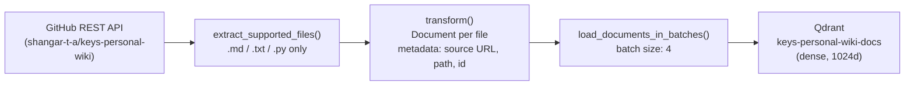

# ETL Pipelines

Offline ingestion job that fetches the `keys-personal-wiki` documentation from GitHub and loads dense vector embeddings into Qdrant. This populates the knowledge base that the Bella Chat RAGAgent queries at runtime.

---

## Processing Flow



---

## Pipeline Stages

**Extract**
Recursively fetches files from `keys-wiki-site/docs` in the GitHub repo via the REST API. Only files with extensions `.md`, `.txt`, or `.py` are included. Requires a GitHub Personal Access Token (PAT).

**Transform**
Each file is wrapped in a `Document` with the following metadata fields: `source` (GitHub HTML URL), `path` (repo-relative path), `id` (UUID4), `source_type` (GITHUB). No chunking is applied — each file is one document.

**Load**
Documents are embedded using Ollama `qwen3-embedding:0.6b` (1024 dimensions) and upserted into the `keys-personal-wiki-docs` Qdrant collection in batches of 4 to avoid GPU overload.

---

## Configuration

```env
QDRANT_URL=http://host.docker.internal:6333
```

The pipeline runs in Docker to isolate heavy Python dependencies (PyTorch, tokenizers) while connecting to Qdrant on the host machine.
