import Tabs from '@theme/Tabs';
import TabItem from '@theme/TabItem';

# Expense Manager

A Clean Architecture FastAPI service and UI for personal‑finance tracking, covering bank accounts, budget categories, savings envelopes, and a monthly allocation planner.

---

<Tabs>
<TabItem value="settings" label="Settings" default>

## Settings Configuration

### Bank Accounts

- Add, rename, or delete checking, savings, credit‑card, or cash accounts.
- Each account feeds into the Account Balances, Monthly Planning, and Wealth Manager views.

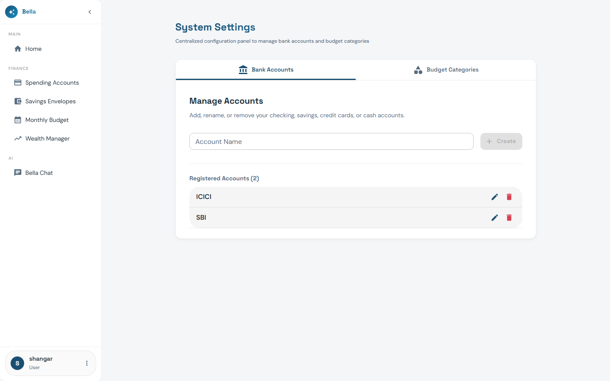

### Budget Categories

- Define **Spending** and **Saving** categories used across all envelopes.
- Categories drive classification in the Monthly Planner checklist.

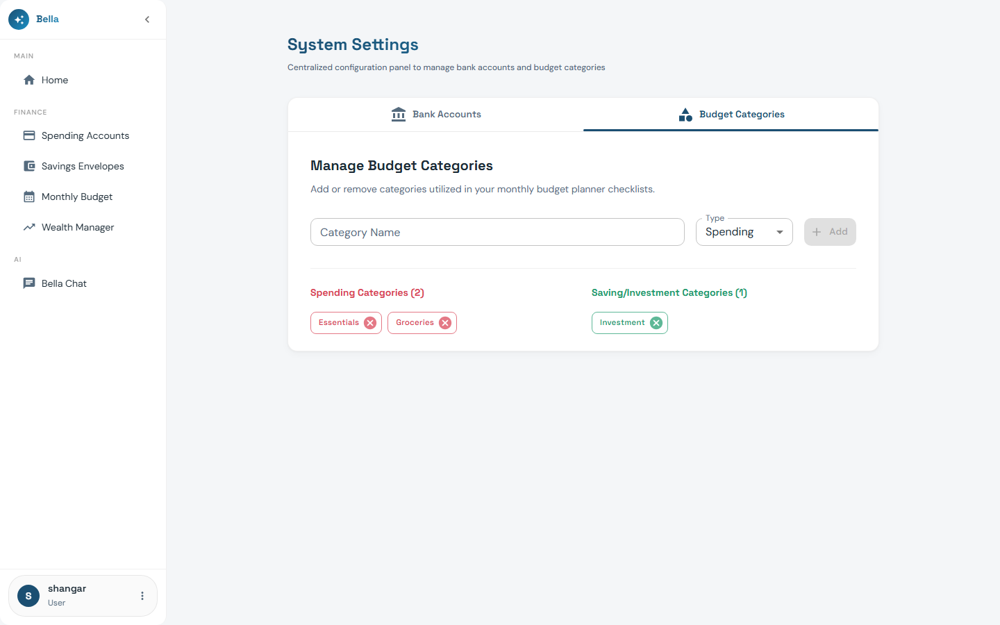

</TabItem>

<TabItem value="balances" label="Account Balances">

## Account Balances Dashboard

### Summary Cards

- Displays **Starting Balance**, **Current Balance**, **Credit Used**, and **Net Balance** as top‑level metric cards.

### Monthly Breakdown Table

- Lists each account with month‑by‑month balances and running totals.
- Used to audit and reconcile spending at the end of each period.

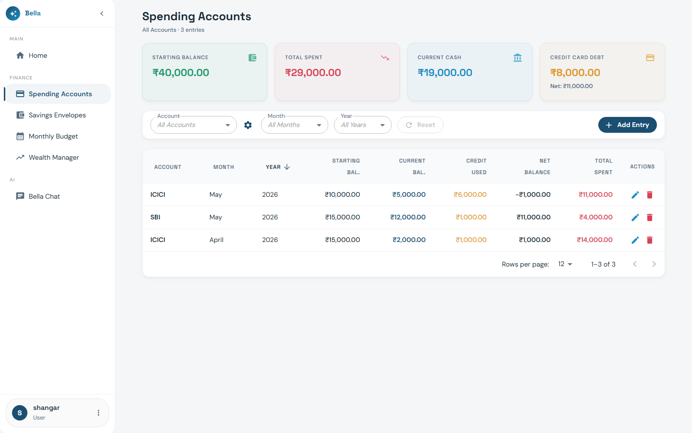

</TabItem>

<TabItem value="envelopes" label="Savings Envelopes">

## Savings Envelopes Allocation

### Envelope Overview

- Envelopes are goal‑based sub‑buckets (e.g., Emergency, LIC, Travel).
- A donut chart visualises the percentage split across all active envelopes.

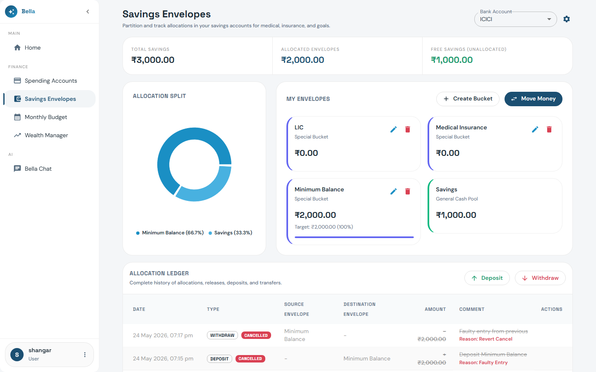

### Allocation Ledger

- Log deposits and withdrawals per envelope.
- Track progress toward each envelope's target balance.

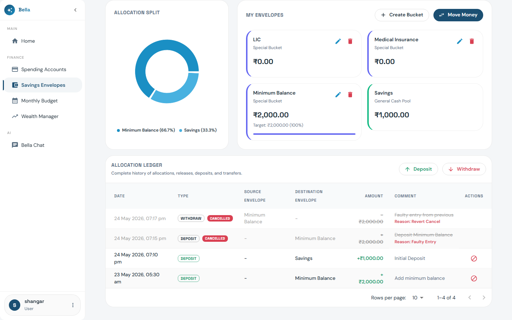

</TabItem>

<TabItem value="planning" label="Monthly Planning">

## Period & Monthly Allocation Planning

### Period Allocation Planner

- Splits total salary into percentages assigned to each envelope.
- Hover over a slice to see the exact amount; click to edit.
- Changes are saved automatically and reflected in the checklist.

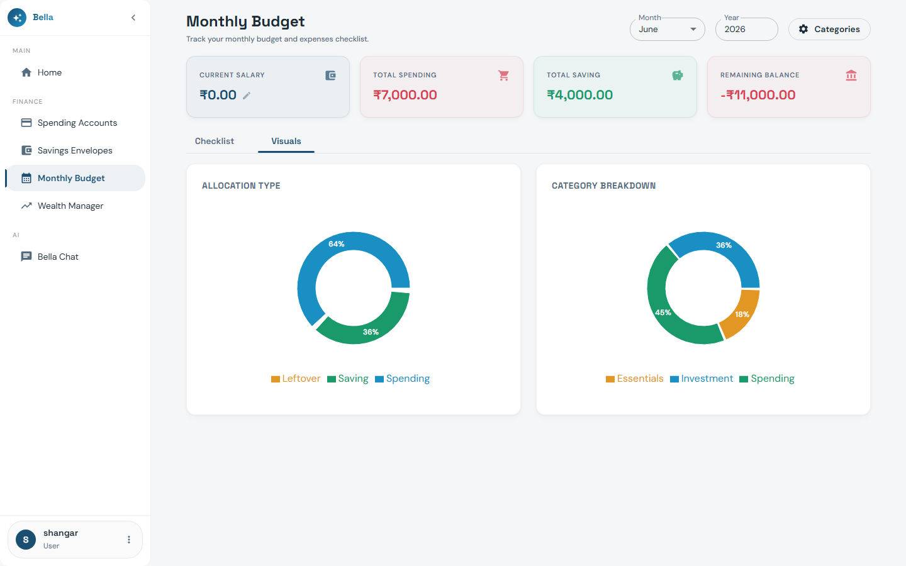

### Monthly Allocation Checklist

- Lists every envelope, the amount allocated, and any notes for the selected month.
- **Controls:** Add, Edit, Sync Previous (copy from last month), Reset.
- Provides a final review before the month begins.

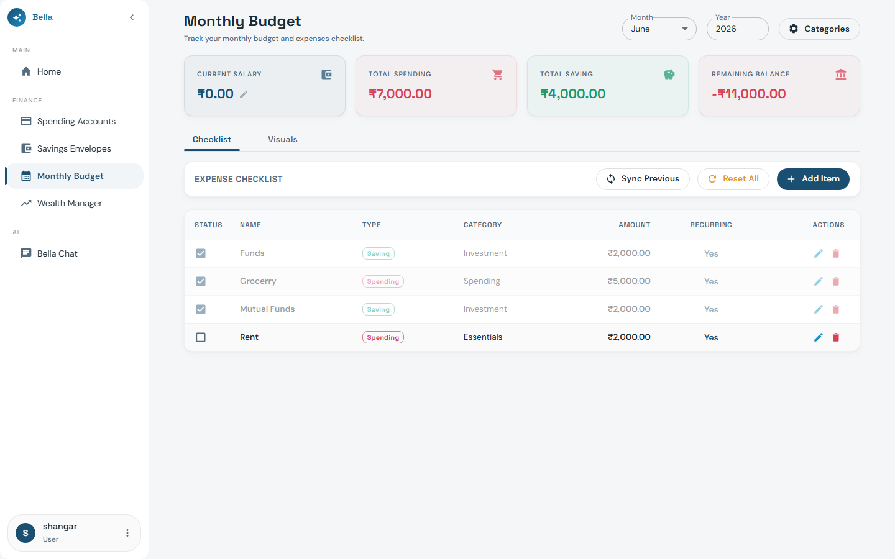

</TabItem>

<TabItem value="assets" label="Assets (Wealth)">

## Wealth Manager: Assets Tracking

Track and manage value-based and unit-based assets in one place to maintain an accurate history of your holdings.

### Asset Categories

- **Equity**: Stocks, mutual funds, ETFs, NPS equity.
- **Debt**: Fixed deposits, PPF, bonds, EPF.
- **Real Estate**: Physical property, land, REITs.
- **Commodities**: Physical gold/silver, digital gold, sovereign gold bonds.
- **Cash & Bank**: Savings accounts, checking accounts, cash in hand.

### Key Metrics

- **Invested Value**: The net cost basis of your holdings (total deposits/purchases minus withdrawals/sales).
- **Current Value**: The market value of assets today.
  - *Value-Based* assets use the latest statement balance.
  - *Unit-Based* assets calculate value automatically: `Units Held × Today's Price`.
- **Gain / Loss**: Calculated as `Current Value − Invested Value`.

### Transaction Types

- **Buy**: Record additional capital purchases or deposits.
- **Sell**: Record asset liquidations or withdrawals.
- **Revalue**: Set an authoritative statement balance to reconcile value history.

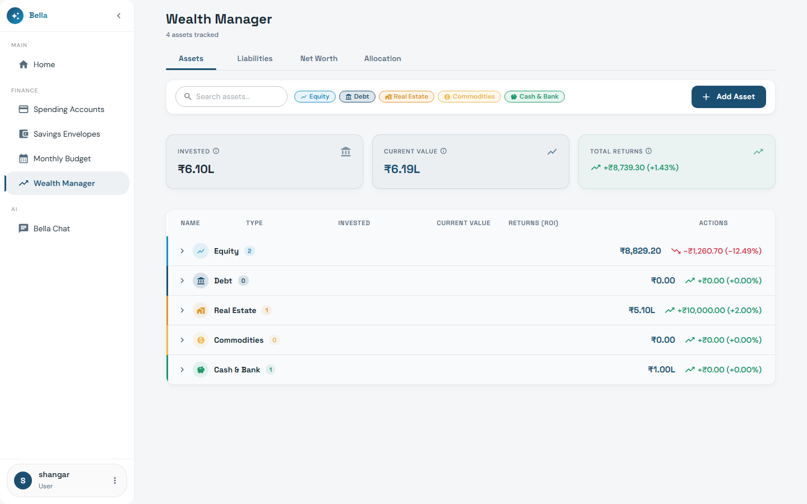

</TabItem>

<TabItem value="liabilities" label="Liabilities (Wealth)">

## Wealth Manager: Liabilities Tracking

Manage scheduled EMI loans and non-EMI interest-bearing liabilities to keep tabs on outstanding debt.

### Core Features

- **Flexible Amortization Engine**: Accrues interest and projects balances over time. Supports Daily, Monthly, Quarterly, Semi-Annual, and Annual compounding frequencies.
- **Non-EMI Liabilities**: Support for interest-bearing loans without scheduled EMIs, useful for family debt or custom financing.
- **Moratorium Configurator**: Set absolute, interest-only, or interest-free moratorium periods in liability simulations.
- **Prepayments Ledger**: Log custom extra repayments (prepayments/part-payments) to reduce outstanding principal.
- **Revalue Entries**: Anchor the simulation engine to reality by logging bank statement outstanding balances. The engine automatically reconciles discrepancies and computes exact interest charges.

### Projections & Payoff Curves

- **Ideal Balance**: Simulated principal reduction if only scheduled EMIs were paid on time.
- **Actual / Projected Balance**: Historical trajectory and future projection based on actual payments and prepayments.
- **Tenure Saved**: Number of months saved by making early prepayments.
- **Interest Saved**: Net interest saved compared to the ideal schedule.

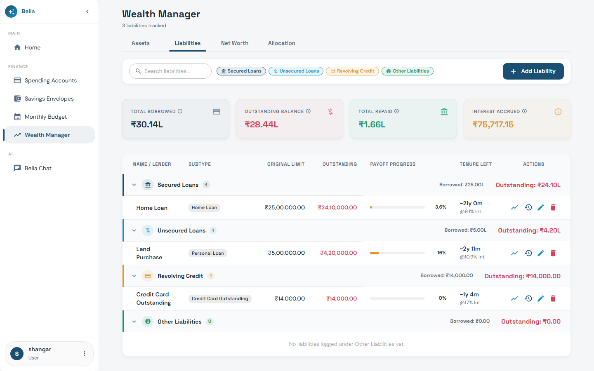

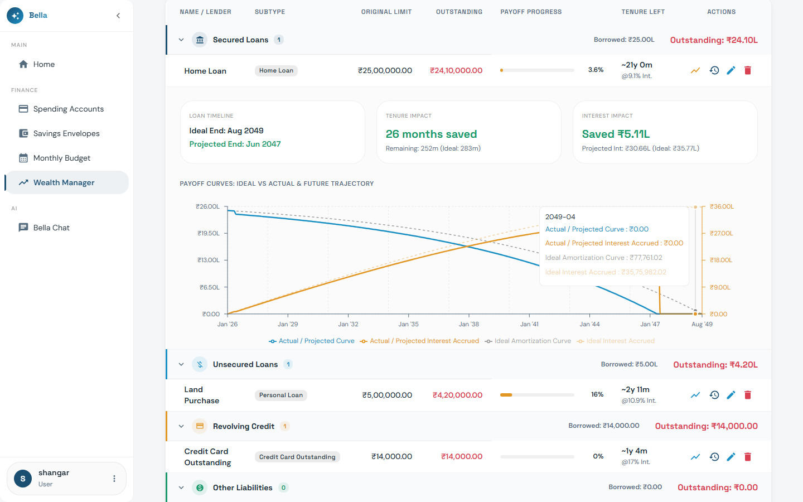

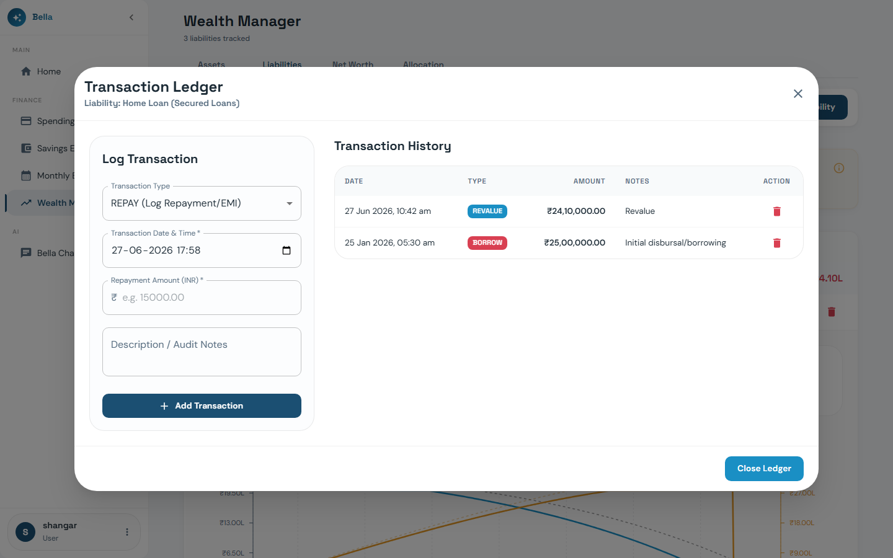

</TabItem>

<TabItem value="networth" label="Net Worth (Wealth)">

## Wealth Manager: Portfolio Net Worth

Understand your ultimate measure of financial health by consolidating assets and liabilities.

```text
Net Worth = (Sum of Asset Current Values) - (Sum of Liability Outstanding Balances)
```

### Dashboard Layout

- **Summary Metrics**: High-level KPI cards displaying Current Net Worth, Total Assets, and Total Liabilities.
- **Historical Trajectory Chart**: A composed area/line chart tracking the last 12 months of your portfolio's assets growth (green area), liabilities reduction (red area), and overall net worth (blue line) trajectory.
- **Historical Net Worth Ledger**: Month-by-month historical data showing exact balances and Month-over-Month (MoM) growth rates.

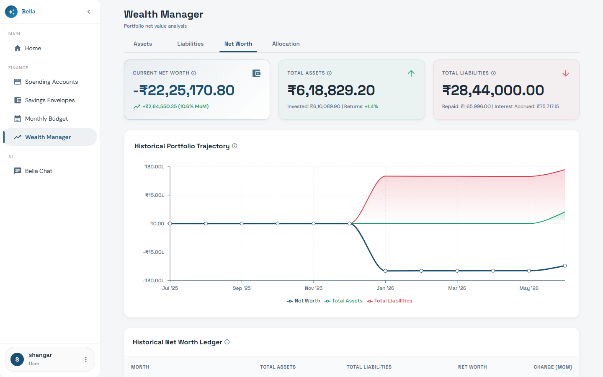

</TabItem>

<TabItem value="allocation" label="Allocation (Wealth)">

## Wealth Manager: Asset Allocation & Health Ratios

Optimize risk and leverage through visual distribution charts and critical health metrics.

### Distribution Visuals

- **Asset Distribution Donut Chart**: Visualizes capital allocations across Equity, Debt, Real Estate, Commodities, and Cash/Bank.
- **Liability Distribution Donut Chart**: Analyzes debt composition (secured loans vs unsecured loans vs revolving credit cards).
- **Financing Leverage Bar**: Compares self-owned Equity vs borrowed Debt financing.

### Portfolio Health Metrics & Risk Gauges

- **Debt-to-Asset Ratio**: Measures total leverage: `(Total Liabilities / Total Assets) × 100`.
  - **Low Risk (Healthy)**: Under 30%
  - **Moderate Risk (Watch)**: 30% to 50%
  - **High Risk (Leveraged)**: Over 50%
- **Portfolio Liquidity Ratio**: Measures short-term buffer: `(Highly Liquid Assets / Total Assets) × 100`.
  - **Healthy Liquidity**: 15% or higher (target is 15% to 35%)
  - **Low Liquidity**: Under 15% (warning zone)

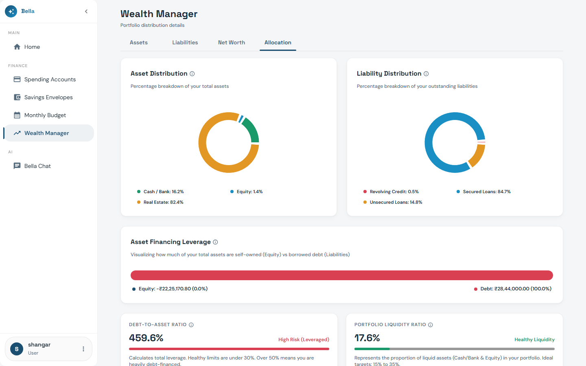

</TabItem>

<TabItem value="architecture" label="Architecture & Tech Stack">

## Folder Structure (Backend)

```text
expense-manager-service/
├── Dockerfile
├── pyproject.toml
├── uv.lock
├── app/
│   ├── main.py                                              # FastAPI app entrypoint
│   ├── entities/                                            # Domain layer
│   │   ├── errors/
│   │   ├── models/                                          # account, asset, liability, period, savings_bucket, spending_entry
│   │   └── repositories/                                    # Abstract repository interfaces
│   ├── infrastructures/
│   │   ├── postgres_db/                                     # Active: PostgreSQL via async SQLAlchemy + Alembic
│   │   ├── sqlite_db/                                       # Deprecated
│   │   └── inmemory_db/                                     # Deprecated
│   ├── routers/
│   │   └── v1/
│   │       ├── endpoints/                                   # accounts, assets, liabilities, periods, savings_buckets, spending_entries, wealth
│   │       ├── mappers/
│   │       ├── schemas/
│   │       └── services.py
│   ├── settings/
│   └── use_cases/
│       ├── errors/
│       └── models/                                          # Service models for assets, liabilities, wealth
└── tests/
    ├── integration/
    └── unit/
```

## Layered Architecture Details

### Domain Layer (`app/entities/`)

- Core business models: `account`, `asset`, `liability`, `monthly_planner`, `period`, `savings_bucket`, `spending_entry`.
- Abstract repository interfaces and domain error types.
- No external library dependencies.

### Use Cases Layer (`app/use_cases/`)

- Application-specific business logic orchestrating entities and repository interfaces.
- Core service aggregates: `account`, `asset`, `liability`, `monthly_planner`, `period`, `savings_bucket`, `spending_entry`, `wealth`, and helper `price_resolver`.

### Infrastructure Layer (`app/infrastructures/`)

- **`postgres_db/`**: Active PostgreSQL implementation using async SQLAlchemy. Alembic manages schema migrations.
- **`sqlite_db/`**: Deprecated.
- **`inmemory_db/`**: Deprecated.

### Presentation/API Layer (`app/routers/`)

- **Purpose:** API endpoints, request/response schemas, and routing.
- **Key Files:**
  - `v1/endpoints/`: FastAPI routers for each resource (e.g., `accounts.py`, `assets.py`, `liabilities.py`, `wealth.py`).
  - `v1/mappers/`: Convert between schemas and entities.
  - `v1/schemas/`: Pydantic schemas for API requests/responses.
  - `v1/services.py`: Dependency injection for repositories/services.

### Configuration Layer (`app/settings/`)

- **Purpose:** Environment and application configuration.
- **Key Files:**
  - `base.py`, `dev.py`, `config.py`: Settings for different environments, loaded via Pydantic.

### Entrypoint

- **`main.py`**: FastAPI app initialization, middleware, and startup logic.

### Tests

- **`tests/`**: Unit and integration tests for all layers.

---

## Technology Stack

- **Python 3.13+** / **FastAPI** / **Uvicorn**
- **Pydantic v2**: Request/response validation and settings management.
- **SQLAlchemy (async)** + **Alembic**: ORM and schema migrations against PostgreSQL.
- **PostgreSQL**: Active production database. SQLite and in-memory implementations are deprecated.
- **uv**: Dependency management.
- **mypy** / **ruff** / **pytest**: Type checking, linting, and testing.

</TabItem>
</Tabs>
