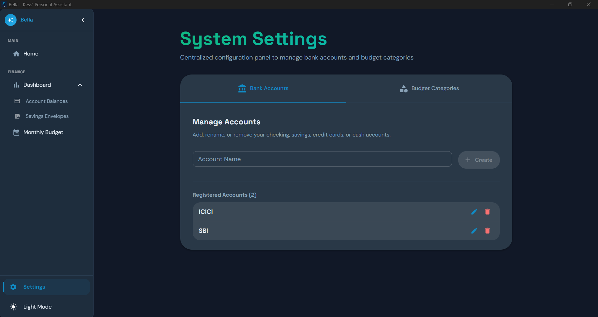
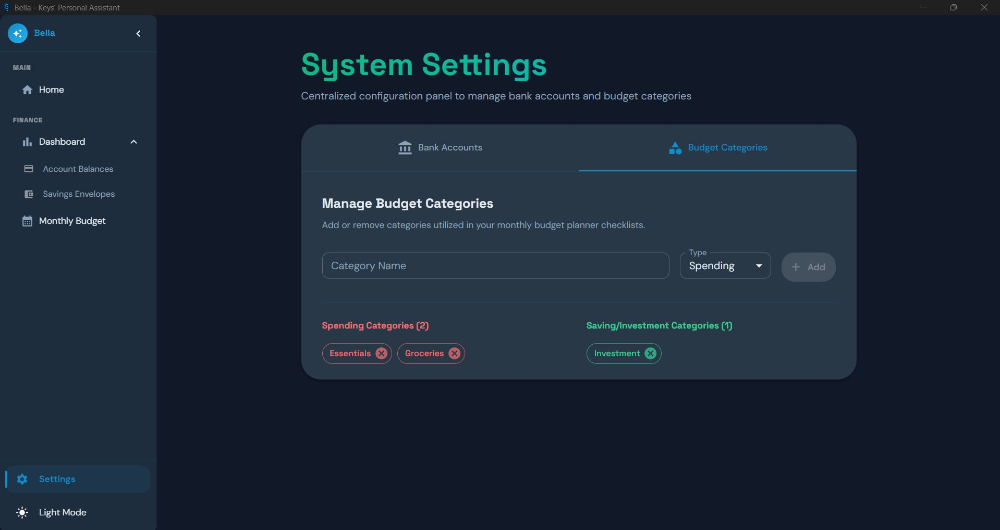
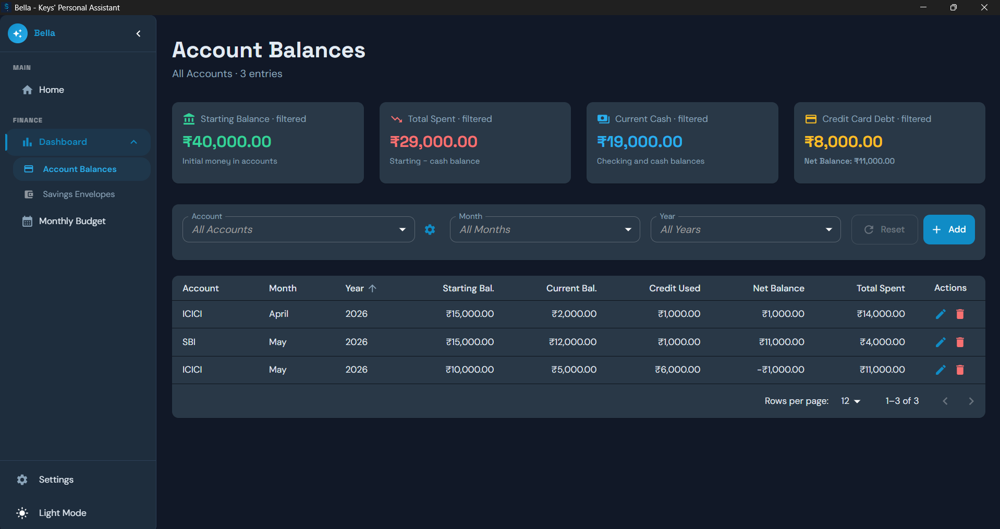
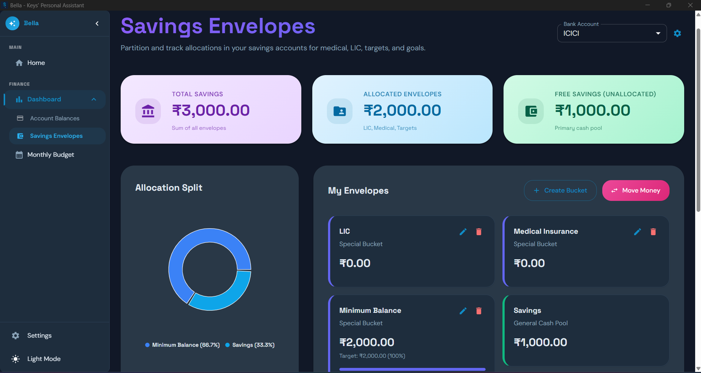
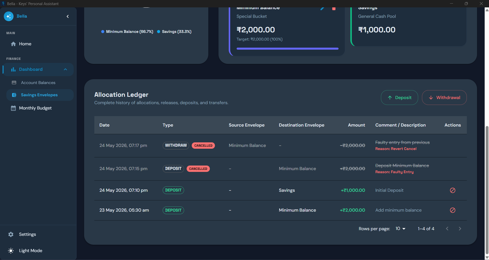
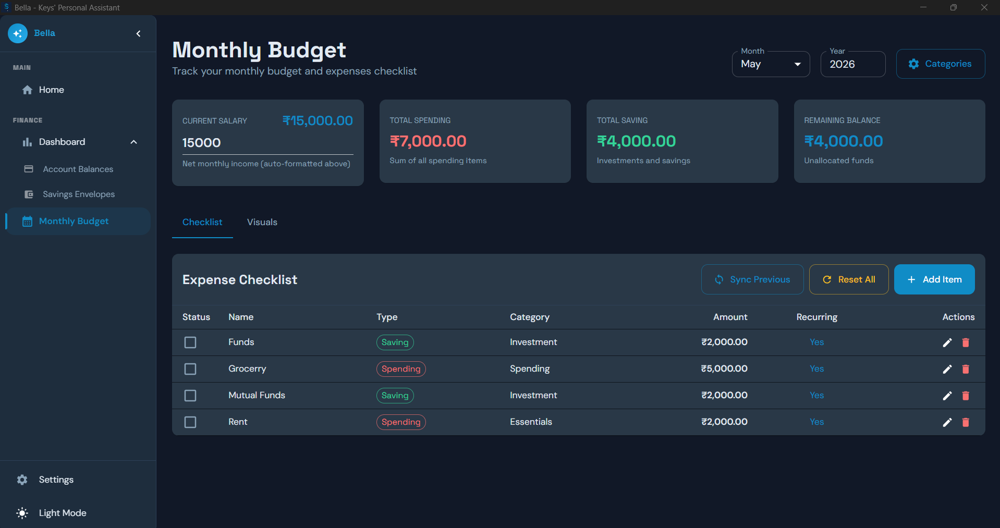
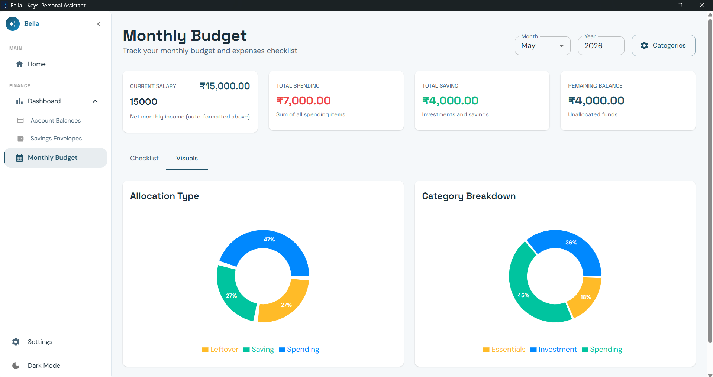

# Expense Manager

A personal‑finance hub covering bank accounts, budget categories, savings envelopes, and a monthly allocation planner.

---

## 1. Settings

### 1.1 Bank Accounts

- Add, rename, or delete checking, savings, credit‑card, or cash accounts.
- Each account feeds into the Account Balances and Monthly Planning views.

### 1.2 Budget Categories

- Define **Spending** and **Saving** categories used across all envelopes.
- Categories drive classification in the Monthly Planner checklist.

---

## 2. Account Balances

### 2.1 Summary Cards

- Displays **Starting Balance**, **Current Balance**, **Credit Used**, and **Net Balance** as top‑level metric cards.

### 2.2 Monthly Breakdown Table

- Lists each account with month‑by‑month balances and running totals.
- Used to audit and reconcile spending at the end of each period.

---

## 3. Savings Envelopes

### 3.1 Envelope Overview

- Envelopes are goal‑based sub‑buckets (e.g., Emergency, LIC, Travel).
- A donut chart visualises the percentage split across all active envelopes.

### 3.2 Allocation Ledger

- Log deposits and withdrawals per envelope.
- Track progress toward each envelope's target balance.

---

## 4. Monthly Planning

### 4.1 Period Allocation Planner

- Splits total salary into percentages assigned to each envelope.
- Hover over a slice to see the exact amount; click to edit.
- Changes are saved automatically and reflected in the checklist.

### 4.2 Monthly Allocation Checklist

- Lists every envelope, the amount allocated, and any notes for the selected month.
- **Controls:** Add, Edit, Sync Previous (copy from last month), Reset.
- Provides a final review before the month begins.

