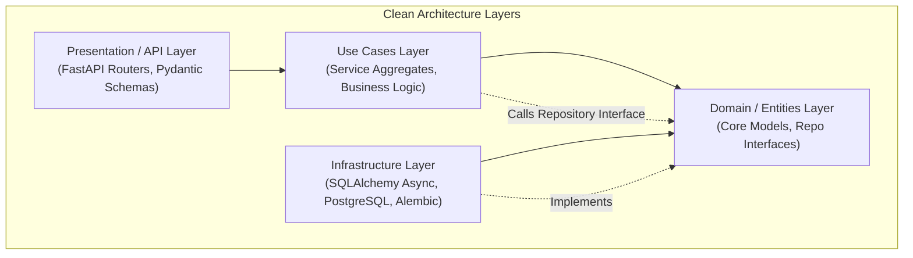

# Expense Manager Service

The Expense Manager Service is a FastAPI-based backend microservice designed for personal finance tracking. It handles bank accounts, budget categories, savings envelopes, monthly budgeting plans, and portfolio wealth analytics.

---

## Technical Architecture

The service adheres strictly to **Clean Architecture** principles to separate business logic from external frameworks and drivers:



### Layered Architecture Details

1. **Domain Layer (`app/entities/`)**
   * Core business models: `account`, `asset`, `liability`, `monthly_planner`, `period`, `savings_bucket`, and `spending_entry`.
   * Abstract repository interfaces defining data-access contracts.
   * Isolated from third-party libraries and frameworks to guarantee core logic portability.

2. **Use Cases Layer (`app/use_cases/`)**
   * Implements application-specific business logic orchestrating domain entities and repository interfaces.
   * Core service modules cover accounts, assets, liabilities, envelope planning, and portfolio net-worth aggregation.

3. **Infrastructure Layer (`app/infrastructures/`)**
   * Handles database persistence and schema migrations.
   * Leverages asynchronous SQLAlchemy to interact with the PostgreSQL database.
   * Uses Alembic for version-controlled database schema migrations.

4. **Presentation/API Layer (`app/routers/`)**
   * Manages HTTP routing, request/response validation via Pydantic v2, and API endpoint configurations.

---

## Folder Structure

```text
expense-manager-service/
├── Dockerfile
├── pyproject.toml
├── uv.lock
├── app/
│   ├── main.py                                              # FastAPI app entrypoint
│   ├── entities/                                            # Domain layer
│   │   ├── errors/
│   │   ├── models/                                          # Account, Asset, Liability, Period, SavingsBucket, SpendingEntry
│   │   └── repositories/                                    # Abstract repository interfaces
│   ├── infrastructures/
│   │   └── postgres_db/                                     # PostgreSQL access via Async SQLAlchemy + Alembic
│   ├── routers/
│   │   └── v1/
│   │       ├── endpoints/                                   # Accounts, Assets, Liabilities, Periods, Buckets, Spending, Wealth
│   │       ├── mappers/                                     # Entity-to-Schema mappers
│   │       ├── schemas/                                     # Pydantic validation schemas
│   │       └── services.py                                  # Dependency injection bindings
│   ├── settings/                                            # Environment configuration (Pydantic BaseSettings)
│   └── use_cases/                                           # Application services (Assets, Liabilities, Wealth logic)
└── tests/
    ├── integration/
    └── unit/
```

---

## Technology Stack

* **Runtime & Framework**: Python 3.13+, FastAPI, Uvicorn (ASGI web server).
* **Data Validation**: Pydantic v2 for request/response serialization.
* **ORM & Database**: Asynchronous SQLAlchemy 2.0 with PostgreSQL as the production database storage engine.
* **Package Management**: Managed with `uv` for fast dependency resolution.
* **Quality Assurance**: Python `pytest` for unit and integration tests, `mypy` for static type checking, and `ruff` for linting.
