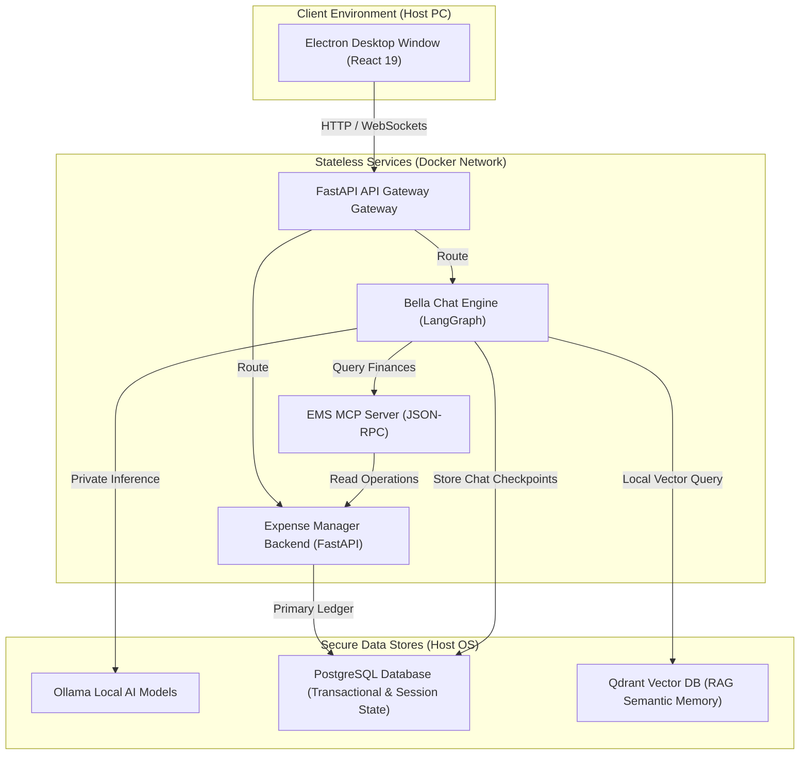

import Tabs from '@theme/Tabs';
import TabItem from '@theme/TabItem';
import GradientHeading from '@site/src/components/core/GradientHeading';
import CenteredIntro from '@site/src/components/core/CenteredIntro';

<GradientHeading
  as="h1"
  gradientFrom="#f1c533ff"
  gradientMid="#f5e97eff"
  gradientTo="#8f860cff"
>
# Bella Keys

</GradientHeading>

<CenteredIntro>
Bella Keys is a desktop application combining a private AI assistant with multi-period expense and budget tracking. It is built to showcase local development patterns using FastAPI, React, Electron, LangGraph, and the Model Context Protocol (MCP).
</CenteredIntro>

---

## Deployment Architecture

The application uses a hybrid deployment structure that isolates stateless application runtimes inside Docker containers while preserving sensitive user databases natively on the host filesystem. This ensures complete data privacy and offline operational capabilities:

---

## Core Components

The application is structured into the following distinct services:

1. **Desktop Client** ([Overview](./expense-manager/index.md))
   - Features a React 19 interface running inside Electron, compiled using Vite and styled with Material UI v6.

2. **Expense Manager Service** ([Technical Details](./expense-manager/architecture.md))
   - Implements FastAPI clean architecture with support for multiple periods and accounts using SQLAlchemy.

3. **Bella Chat Service** ([Agent Details](./bella-chat/architecture.md))
   - Orchestrates multi-turn conversations and task execution using LangGraph, Qdrant semantic memory, and Ollama.

4. **Integration Interfaces** ([Protocol Details](./mcp-integration/index.md))
   - Exposes database read tools to the LLM via the Model Context Protocol (MCP) and processes knowledge ingestion via ETL pipelines.

---

## User Workspace Showcase

<Tabs>
  <TabItem value="budget" label="Budgeting and Envelopes" default>
    <h3>Envelope Allocations and Period Parameters</h3>
    
Distribute active monthly income into customized spending and savings envelopes. The table updates balances in real-time as expense items are added.

    
      
    <h3>Savings Envelopes Breakdown</h3>
    
Monitor target progress and transaction balances dynamically for savings objectives:

    
    
  </TabItem>
  <TabItem value="accounts" label="Accounts and Balances">
    <h3>Liquid Assets and Liabilities</h3>
    
Consolidate bank accounts, savings allocations, and credit liabilities into a single view to monitor net worth statistics:

    
      
    <h3>Account and Category Configurations</h3>
    
Manage active ledger accounts and category thresholds directly inside settings cards:

    
    
  </TabItem>
  <TabItem value="chat" label="Intelligent Assistant">
    <h3>Multi-Turn Agentic Chat Workspace</h3>
    
The desktop chat panel connects to containerized LangGraph workflows, routing data searches through the local database and vector indexes:

    
      
    <h3>Context Retrieval with Grounded Citations</h3>
    
The chatbot performs semantic vector RAG to retrieve matching documentation references with dynamic overlays:

    
  </TabItem>
</Tabs>
