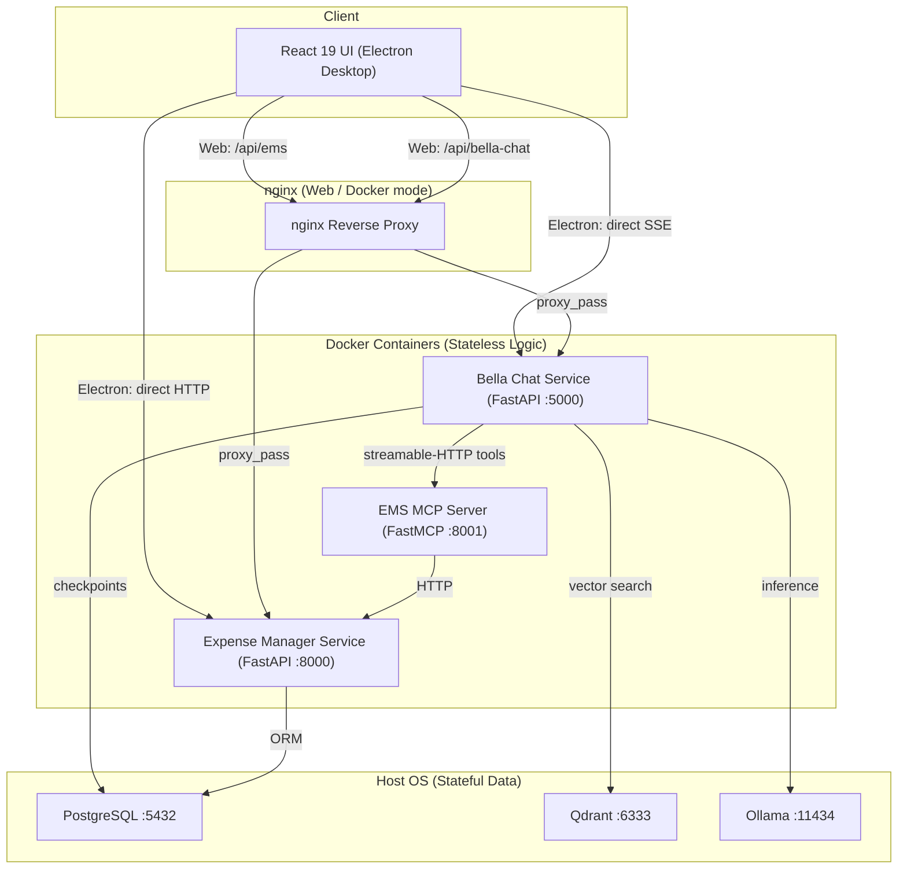

import Tabs from '@theme/Tabs';
import TabItem from '@theme/TabItem';
import CenteredIntro from '@site/src/components/core/CenteredIntro';

# Bella Assist

<CenteredIntro>
Bella Assist is a privacy-first desktop application combining a personal AI assistant with multi-period expense and budget tracking. Built on LangGraph, FastAPI, React, Electron, and the Model Context Protocol.
</CenteredIntro>

---

## Deployment Architecture

Bella Assist uses an inside-out architecture: application logic runs in Docker containers while all user data (PostgreSQL, Qdrant, Ollama models) stays on the host machine. The React UI is served by nginx in web mode and connects directly to services in Electron mode.

---

## Core Components

1. **Desktop Client**
   React 19 interface inside Electron, compiled with Vite and styled with Material UI v6. Served by nginx in web/Docker mode; connects directly to services in Electron mode.

2. **Expense Manager Service** ([Technical Details](./expense-manager.md))
   Clean Architecture FastAPI service for multi-period budgeting, savings envelopes, and account tracking. Backed by async SQLAlchemy and PostgreSQL.

3. **Bella Chat Service** ([Agent Details](./bella-chat.md))
   LangGraph `create_agent` orchestrator with RAG knowledge search, MCP tool use, SSE streaming, and Arize Phoenix observability. Supports Ollama (local) and Google Gemini as the LLM backend.

4. **EMS MCP Server** ([Server Details](./ems-mcp-server.md))
   FastMCP service exposing EMS financial data as read-only LLM-callable tools over streamable HTTP.

5. **ETL Pipelines** ([Pipeline Details](./etl-pipelines.md))
   Offline ingestion job that fetches wiki docs from GitHub and loads dense vector embeddings into Qdrant.

---

## User Workspace Showcase

<Tabs>
  <TabItem value="budget" label="Budget and Envelopes" default>
    <h3>Period Allocation Planner</h3>
    
Distribute active monthly income into customized spending and savings envelopes using an interactive radial allocation planner:

    
      
    <h3>Savings Envelopes Breakdown</h3>
    
Monitor target progress, category splits, and transaction ledger updates dynamically for savings objectives:

    
    
  </TabItem>
  <TabItem value="accounts" label="Accounts and Balances">
    <h3>Liquid Ledger and Reconciliations</h3>
    
Consolidate bank accounts, credit liabilities, and transaction histories into a single view to monitor liquid balances:

    
      
    <h3>Account and Category Configurations</h3>
    
Manage active ledger accounts and category thresholds directly inside settings cards:

    
    
  </TabItem>
  <TabItem value="wealth" label="Wealth Manager">
    <h3>Assets Trackers</h3>
    
Track value-based (e.g. cash, savings) and unit-based (e.g. equity, gold) assets across five distinct categories:

    
      
    <h3>Liabilities Tracking & Projections</h3>
    
Model Scheduled EMI and Non-EMI interest-bearing liabilities, configure moratoriums, and project long-term amortization curves:

    
      
    <h3>Historical Net Worth Trajectory</h3>
    
Visualize the 12-month trajectory of assets, liabilities, and net worth side-by-side using composed charts:

    
      
    <h3>Portfolio Allocation & Health Ratios</h3>
    
Monitor self-owned asset financing leverage and track portfolio liquidity and debt risk ratios against industry-standard limits:

    
  </TabItem>
  <TabItem value="chat" label="Intelligent Assistant">
    <h3>Multi-Turn Agentic Chat Workspace</h3>
    
The desktop chat panel supports multi-turn conversations and connects to the LangGraph OrchestratorAgent, routing queries to financial data tools (e.g. EMS MCP server tools to retrieve top expenses) or summarizing the chat history:

    
      
    <h3>Context Retrieval with Grounded Citations</h3>
    
The agent uses the RAG search tool to perform semantic vector search against the Qdrant knowledge base, returning grounded answers with clickable source citations:

    
  </TabItem>
</Tabs>
