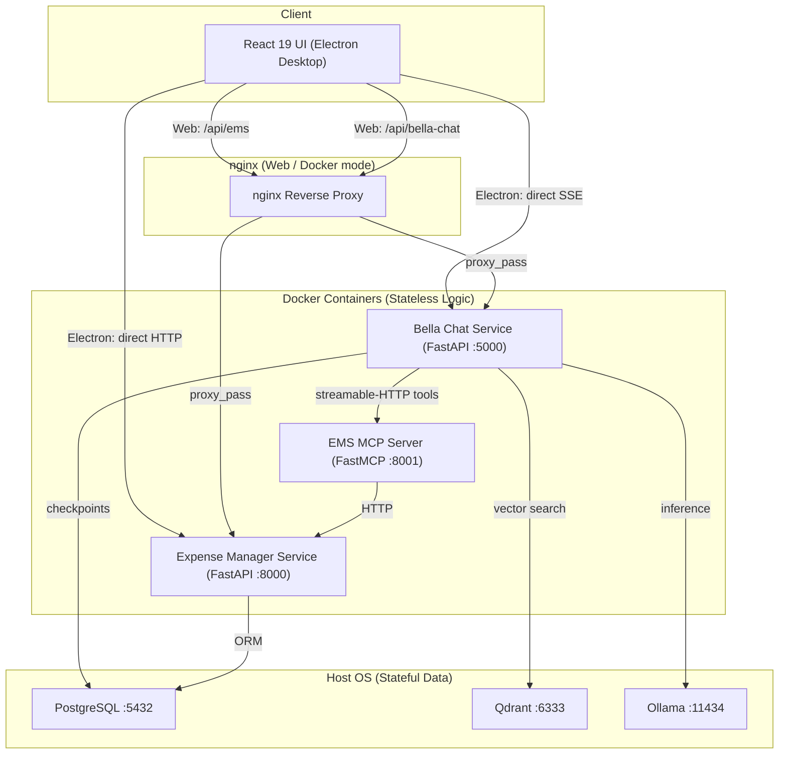

import Tabs from '@theme/Tabs';
import TabItem from '@theme/TabItem';
import CenteredIntro from '@site/src/components/core/CenteredIntro';

# Bella Assist

<CenteredIntro>
Bella Assist is a privacy-first desktop application combining a personal AI assistant with multi-period expense and budget tracking. Built on LangGraph, FastAPI, React, Electron, and the Model Context Protocol.
</CenteredIntro>

---

## Deployment Architecture

Bella Assist uses an inside-out architecture: application logic runs in Docker containers while all user data (PostgreSQL, Qdrant, Ollama models) stays on the host machine. The React UI is served by nginx in web mode and connects directly to services in Electron mode.

---

## Core Components

1. **Desktop Client**
   React 19 interface inside Electron, compiled with Vite and styled with Material UI v6. Served by nginx in web/Docker mode; connects directly to services in Electron mode.

2. **Expense Manager Service** ([Technical Details](./expense-manager.md))
   Clean Architecture FastAPI service for multi-period budgeting, savings envelopes, and account tracking. Backed by async SQLAlchemy and PostgreSQL.

3. **Bella Chat Service** ([Agent Details](./bella-chat.md))
   LangGraph `create_agent` orchestrator with RAG knowledge search, MCP tool use, SSE streaming, and Arize Phoenix observability. Supports Ollama (local) and Google Gemini as the LLM backend.

4. **EMS MCP Server** ([Server Details](./ems-mcp-server.md))
   FastMCP service exposing EMS financial data as read-only LLM-callable tools over streamable HTTP.

5. **ETL Pipelines** ([Pipeline Details](./etl-pipelines.md))
   Offline ingestion job that fetches wiki docs from GitHub and loads dense vector embeddings into Qdrant.

---

## User Workspace Showcase

<Tabs>
  <TabItem value="budget" label="Budgeting and Envelopes" default>
    <h3>Envelope Allocations and Period Parameters</h3>
    
Distribute active monthly income into customized spending and savings envelopes. The table updates balances in real-time as expense items are added.

    
      
    <h3>Savings Envelopes Breakdown</h3>
    
Monitor target progress and transaction balances dynamically for savings objectives:

    
    
  </TabItem>
  <TabItem value="accounts" label="Accounts and Balances">
    <h3>Liquid Assets and Liabilities</h3>
    
Consolidate bank accounts, savings allocations, and credit liabilities into a single view to monitor net worth statistics:

    
      
    <h3>Account and Category Configurations</h3>
    
Manage active ledger accounts and category thresholds directly inside settings cards:

    
    
  </TabItem>
  <TabItem value="chat" label="Intelligent Assistant">
    <h3>Multi-Turn Agentic Chat Workspace</h3>
    
The desktop chat panel connects to the LangGraph OrchestratorAgent, routing queries to financial data tools or the RAG knowledge base:

    
      
    <h3>Context Retrieval with Grounded Citations</h3>
    
The RAGAgent performs semantic vector search and returns source-linked citations alongside the answer:

    
  </TabItem>
</Tabs>
