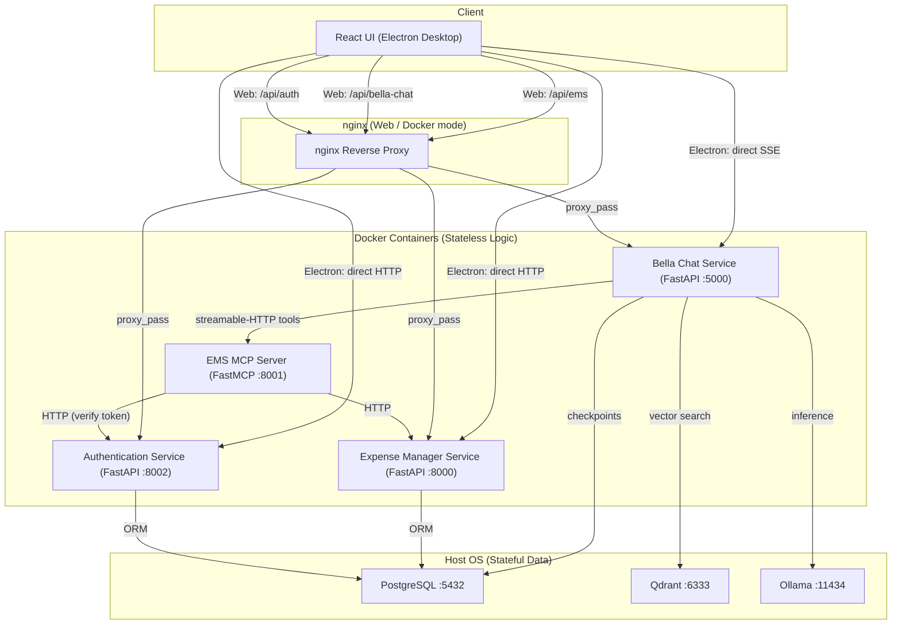

import Tabs from '@theme/Tabs';
import TabItem from '@theme/TabItem';
import CenteredIntro from '@site/src/components/core/CenteredIntro';

# Bella Assist

<CenteredIntro>
Bella Assist is a local-first desktop application that integrates an AI personal assistant with multi-period budgeting, asset and liability tracking, and semantic search. The application is built using a clean-architecture backend in FastAPI, a React interface packaged inside Electron, and custom Model Context Protocol (MCP) servers.
</CenteredIntro>

---

## Deployed Documentation & Live Showcase

To ensure smooth documentation reuse and prevent content duplication across repositories, the primary technical specs, user manuals, and developer standards are maintained and deployed directly alongside the application source code.

* **[Live User Journey Showcase](https://shangar-t-a.github.io/bella-keys-personal-assist/)** — Interactive light & dark theme UI walkthrough.
* **[GitHub Repository](https://github.com/shangar-t-a/bella-keys-personal-assist)** — Source code, issue tracker, and project releases.

### User Guides & Manuals

* **[User Setup & Installation Guide](https://github.com/shangar-t-a/bella-keys-personal-assist/blob/main/docs/user/setup-guide.md)** — Native host prerequisites, PostgreSQL/Ollama initialization, and Docker deployment scripts.
* **[Authentication & Security Guide](https://github.com/shangar-t-a/bella-keys-personal-assist/blob/main/docs/user/authentication-guide.md)** — SSO identity management, JWT access tokens, HttpOnly refresh cookies, and token rotation.
* **[Wealth Manager Guide](https://github.com/shangar-t-a/bella-keys-personal-assist/blob/main/docs/user/wealth-manager-guide.md)** — Asset trackers, interest-bearing liabilities, EMI projections, and net worth trajectory models.

### Developer & Architecture Specifications

* **[System Architecture & Coding Standards](https://github.com/shangar-t-a/bella-keys-personal-assist/blob/main/docs/developer/architecture-standards.md)** — Layered Clean Architecture rules, stateless containers, and backend standards.
* **[Developer Workflow](https://github.com/shangar-t-a/bella-keys-personal-assist/blob/main/docs/developer/development-workflow.md)** — Monorepo layout, local execution scripts, dependency management, and linting standards.
* **[MCP Authorization Specification](https://github.com/shangar-t-a/bella-keys-personal-assist/blob/main/docs/developer/mcp-authorization.md)** — Security boundaries, bearer token verification, and FastMCP integration design.
* **[Frontend & UI Guidelines](https://github.com/shangar-t-a/bella-keys-personal-assist/blob/main/docs/developer/frontend-guidelines.md)** — React 18/19, Material UI v6 design system, accessibility, and [UI Guidelines](https://github.com/shangar-t-a/bella-keys-personal-assist/blob/main/docs/developer/ui-guidelines.md).
* **[Testing Guidelines](https://github.com/shangar-t-a/bella-keys-personal-assist/blob/main/docs/developer/testing-guidelines.md)** — Async unit testing, integration test suits, and pytest conventions.

---

## Deployment Architecture

Bella Assist uses a hybrid local architecture: stateless application logic runs within containerized Docker environments while all stateful user data (PostgreSQL databases, Qdrant vector store, and Ollama model inference) is maintained directly on the host machine to ensure privacy and data sovereignty.

```mermaid
graph TD
    subgraph Client ["Client"]
        UI["React UI (Electron Desktop)"]
    end

    subgraph Gateway ["nginx (Web / Docker mode)"]
        Nginx["nginx Reverse Proxy"]
    end

    subgraph Containers ["Docker Containers (Stateless Logic)"]
        EMS["Expense Manager Service (FastAPI :8000)"]
        Chat["Bella Chat Service (FastAPI :5000)"]
        MCPServer["EMS MCP Server (FastMCP :8001)"]
        Auth["Authentication Service (FastAPI :8002)"]
    end

    subgraph Host ["Host OS (Stateful Data)"]
        Postgres["PostgreSQL :5432"]
        Qdrant["Qdrant :6333"]
        Ollama["Ollama :11434"]
    end

    UI -->|"Electron: direct HTTP"| EMS
    UI -->|"Electron: direct SSE"| Chat
    UI -->|"Electron: direct HTTP"| Auth
    UI -->|"Web: /api/ems"| Nginx
    UI -->|"Web: /api/bella-chat"| Nginx
    UI -->|"Web: /api/auth"| Nginx
    Nginx -->|"proxy_pass"| EMS
    Nginx -->|"proxy_pass"| Chat
    Nginx -->|"proxy_pass"| Auth
    Chat -->|"streamable-HTTP tools"| MCPServer
    MCPServer -->|"HTTP"| EMS
    MCPServer -->|"HTTP (verify token)"| Auth
    Chat -->|"vector search"| Qdrant
    Chat -->|"checkpoints"| Postgres
    Chat -->|"inference"| Ollama
    EMS -->|"ORM"| Postgres
    Auth -->|"ORM"| Postgres
```

---

## Core Components

1. **Desktop Client** ([Codebase](https://github.com/shangar-t-a/bella-keys-personal-assist/tree/main/keys-personal-assist-ui))
   React 19 interface inside Electron, compiled with Vite and styled with Material UI v6. Served by nginx in web/Docker mode; connects directly to services in Electron mode.

2. **Expense Manager Service** ([Codebase](https://github.com/shangar-t-a/bella-keys-personal-assist/tree/main/services/expense-manager-service))
   Clean Architecture FastAPI service for budgeting, savings envelopes, and account tracking. Backed by async SQLAlchemy and PostgreSQL.

3. **Authentication Service** ([Codebase](https://github.com/shangar-t-a/bella-keys-personal-assist/tree/main/services/auth-service) | [Guide](https://github.com/shangar-t-a/bella-keys-personal-assist/blob/main/docs/user/authentication-guide.md))
   FastAPI identity manager handling registration, login, and secure sessions via token rotation and HttpOnly cookies.

4. **Bella Chat Service** ([Codebase](https://github.com/shangar-t-a/bella-keys-personal-assist/tree/main/services/bella-chat-service))
   LangGraph `create_agent` orchestrator with RAG knowledge search, MCP tool use, SSE streaming, and Arize Phoenix observability. Supports Ollama (local) and Google Gemini as the LLM backend.

5. **EMS MCP Server** ([Codebase](https://github.com/shangar-t-a/bella-keys-personal-assist/tree/main/mcps/ems-mcp-server) | [Specification](https://github.com/shangar-t-a/bella-keys-personal-assist/blob/main/docs/developer/mcp-authorization.md))
   FastMCP service exposing EMS financial data as read-only LLM-callable tools over streamable HTTP.

6. **ETL Pipelines** ([Codebase](https://github.com/shangar-t-a/bella-keys-personal-assist/tree/main/services/etl-pipelines))
   Offline ingestion job that fetches wiki docs from GitHub and loads dense vector embeddings into Qdrant.

---

## User Workspace Showcase

<Tabs groupId="theme-preference">
  <TabItem value="light" label="Light Theme" default>
    <h3>Period Allocation Planner</h3>
    
Distribute active monthly income into customized spending and savings envelopes using an interactive radial allocation planner:

    
      
    <h3>Savings Envelopes Breakdown</h3>
    
Monitor target progress, category splits, and transaction ledger updates dynamically for savings objectives:

    
    
  </TabItem>
  <TabItem value="dark" label="Dark Theme">
    <h3>Period Allocation Planner</h3>
    
Distribute active monthly income into customized spending and savings envelopes using an interactive radial allocation planner:

    
      
    <h3>Savings Envelopes Breakdown</h3>
    
Monitor target progress, category splits, and transaction ledger updates dynamically for savings objectives:

    
    
  </TabItem>
</Tabs>

<Tabs groupId="theme-preference">
  <TabItem value="light" label="Light Theme" default>
    <h3>Liquid Ledger and Reconciliations</h3>
    
Consolidate bank accounts, credit liabilities, and transaction histories into a single view to monitor liquid balances:

    
      
    <h3>Account and Category Configurations</h3>
    
Manage active ledger accounts and category thresholds directly inside settings cards:

    
    
  </TabItem>
  <TabItem value="dark" label="Dark Theme">
    <h3>Liquid Ledger and Reconciliations</h3>
    
Consolidate bank accounts, credit liabilities, and transaction histories into a single view to monitor liquid balances:

    
      
    <h3>Account and Category Configurations</h3>
    
Manage active ledger accounts and category thresholds directly inside settings cards:

    
    
  </TabItem>
</Tabs>

<Tabs groupId="theme-preference">
  <TabItem value="light" label="Light Theme" default>
    <h3>Assets Trackers</h3>
    
Track value-based (e.g. cash, savings) and unit-based (e.g. equity, gold) assets across five distinct categories:

    
      
    <h3>Liabilities Tracking & Projections</h3>
    
Model Scheduled EMI and Non-EMI interest-bearing liabilities, configure moratoriums, and project long-term amortization curves:

    
      
    <h3>Historical Net Worth Trajectory</h3>
    
Visualize the 12-month trajectory of assets, liabilities, and net worth side-by-side using composed charts:

    
      
    <h3>Portfolio Allocation & Health Ratios</h3>
    
Monitor self-owned asset financing leverage and track portfolio liquidity and debt risk ratios against industry-standard limits:

    
  </TabItem>
  <TabItem value="dark" label="Dark Theme">
    <h3>Assets Trackers</h3>
    
Track value-based (e.g. cash, savings) and unit-based (e.g. equity, gold) assets across five distinct categories:

    
      
    <h3>Liabilities Tracking & Projections</h3>
    
Model Scheduled EMI and Non-EMI interest-bearing liabilities, configure moratoriums, and project long-term amortization curves:

    
      
    <h3>Historical Net Worth Trajectory</h3>
    
Visualize the 12-month trajectory of assets, liabilities, and net worth side-by-side using composed charts:

    
      
    <h3>Portfolio Allocation & Health Ratios</h3>
    
Monitor self-owned asset financing leverage and track portfolio liquidity and debt risk ratios against industry-standard limits:

    
  </TabItem>
</Tabs>

<Tabs groupId="theme-preference">
  <TabItem value="light" label="Light Theme" default>
    <h3>Multi-Turn Agentic Chat Workspace</h3>
    
The desktop chat panel supports multi-turn conversations and connects to the LangGraph OrchestratorAgent, routing queries to financial data tools (e.g. EMS MCP server tools to retrieve top expenses) or summarizing the chat history:

    
      
    <h3>Context Retrieval with Grounded Citations</h3>
    
The agent uses the RAG search tool to perform semantic vector search against the Qdrant knowledge base, returning grounded answers with clickable source citations:

    
  </TabItem>
  <TabItem value="dark" label="Dark Theme">
    <h3>Multi-Turn Agentic Chat Workspace</h3>
    
The desktop chat panel supports multi-turn conversations and connects to the LangGraph OrchestratorAgent, routing queries to financial data tools (e.g. EMS MCP server tools to retrieve top expenses) or summarizing the chat history:

    
      
    <h3>Context Retrieval with Grounded Citations</h3>
    
The agent uses the RAG search tool to perform semantic vector search against the Qdrant knowledge base, returning grounded answers with clickable source citations:

    
  </TabItem>
</Tabs>
