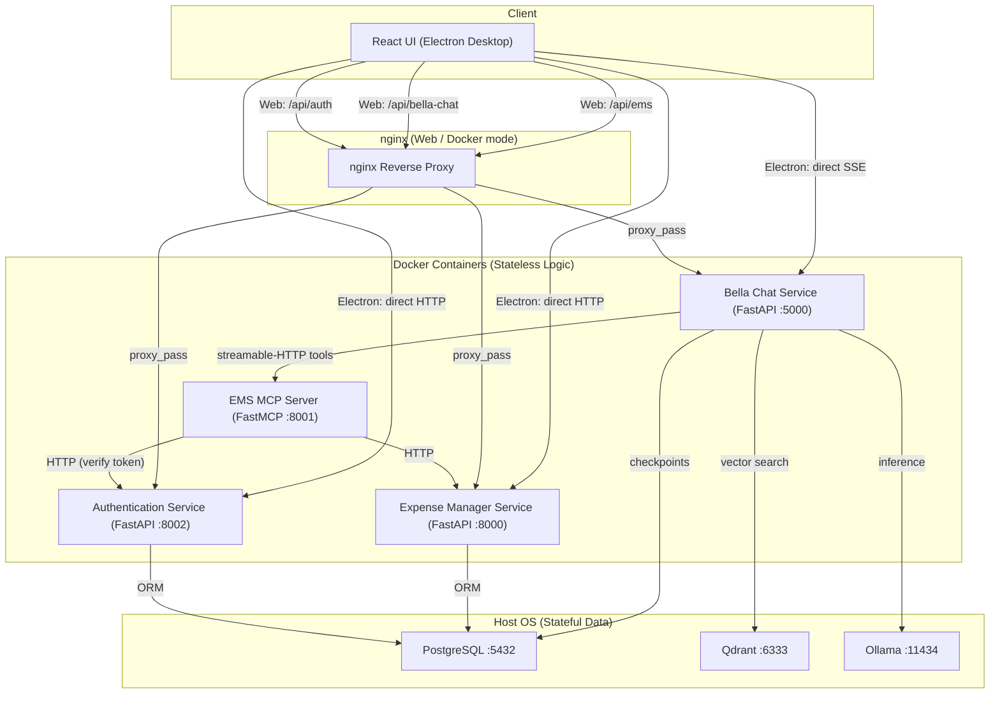

import CenteredIntro from '@site/src/components/core/CenteredIntro';

# Bella Assist

<CenteredIntro>
Bella Assist is a local-first desktop application that integrates an AI personal assistant with multi-period budgeting, asset and liability tracking, and semantic search. The application is built using a clean-architecture backend in FastAPI, a React interface packaged inside Electron, and custom Model Context Protocol (MCP) servers.
</CenteredIntro>

---

## Live User Journey Showcase

Explore the interactive application showcase rendered directly below, featuring full screen navigation, light/dark theme switching, budget visualizations, net worth trajectories, and AI chat capabilities.

<iframe
  src="/keys-personal-wiki/showcase/user-journey.html"
  style={{
    width: '100%',
    height: '800px',
    border: '1px solid var(--ifm-color-emphasis-300)',
    borderRadius: '12px',
    boxShadow: '0 4px 20px rgba(0, 0, 0, 0.08)',
    marginBottom: '2rem'
  }}
  title="Bella Assist Interactive User Journey Showcase"
  loading="lazy"
/>

* <a href="/keys-personal-wiki/showcase/user-journey.html" target="_blank" rel="noopener noreferrer"><strong>Open Showcase in Fullscreen</strong></a> &mdash; Open the live showcase in a dedicated browser tab.

---

## Documentation

All user-facing documentation is maintained in this wiki. Technical specifications and developer guidelines are maintained internally within the project repository.

### User Guides &amp; Manuals

* **[User Setup &amp; Installation Guide](/docs/projects/bella-assist/setup-guide)** — Native host prerequisites, PostgreSQL/Ollama initialization, Docker deployment, and `bella-manager` production orchestration.
* **[Bella TUI Terminal Guide](/docs/projects/bella-assist/bella-tui-guide)** — Installation, authentication flow, keyboard shortcuts, feature workflows, and scriptable commands for the `bella` terminal companion.
* **[Wealth Manager Guide](/docs/projects/bella-assist/wealth-manager-guide)** — Asset trackers, interest-bearing liabilities, EMI projections, and net worth trajectory models.
* **[Single Sign-On &amp; Session Guide](/docs/projects/bella-assist/sso-login)** — Single Sign-On workflow across Web and Electron, session lifecycle, and logout protocols.
* **[Permissions, Scopes &amp; AI Delegation](/docs/projects/bella-assist/permissions-and-delegation)** — Permission scope descriptions and zero-trust On-Behalf-Of (OBO) token delegation architecture.

---

## Deployment Architecture

Bella Assist uses a hybrid local architecture: stateless application logic runs within containerized Docker environments while all stateful user data (PostgreSQL databases, Qdrant vector store, and Ollama model inference) is maintained directly on the host machine to ensure privacy and data sovereignty.

```mermaid
graph TD
    subgraph Client ["Client"]
        UI["React UI (Electron Desktop)"]
    end

    subgraph Gateway ["nginx (Web / Docker mode)"]
        Nginx["nginx Reverse Proxy"]
    end

    subgraph Containers ["Docker Containers (Stateless Logic)"]
        EMS["Expense Manager Service (FastAPI :8000)"]
        Chat["Bella Chat Service (FastAPI :5000)"]
        MCPServer["EMS MCP Server (FastMCP :8001)"]
        Auth["Authentication Service (FastAPI :8002)"]
    end

    subgraph Host ["Host OS (Stateful Data)"]
        Postgres["PostgreSQL :5432"]
        Qdrant["Qdrant :6333"]
        Ollama["Ollama :11434"]
    end

    UI -->|"Electron: direct HTTP"| EMS
    UI -->|"Electron: direct SSE"| Chat
    UI -->|"Electron: direct HTTP"| Auth
    UI -->|"Web: /api/ems"| Nginx
    UI -->|"Web: /api/bella-chat"| Nginx
    UI -->|"Web: /api/auth"| Nginx
    Nginx -->|"proxy_pass"| EMS
    Nginx -->|"proxy_pass"| Chat
    Nginx -->|"proxy_pass"| Auth
    Chat -->|"streamable-HTTP tools"| MCPServer
    MCPServer -->|"HTTP"| EMS
    MCPServer -->|"HTTP (verify token)"| Auth
    Chat -->|"vector search"| Qdrant
    Chat -->|"checkpoints"| Postgres
    Chat -->|"inference"| Ollama
    EMS -->|"ORM"| Postgres
    Auth -->|"ORM"| Postgres
```

---

## Core Components

1. **Desktop Client**
   React 19 interface inside Electron, compiled with Vite and styled with Material UI v6. Served by nginx in web/Docker mode; connects directly to services in Electron mode.

2. **Expense Manager Service**
   Clean Architecture FastAPI service for budgeting, savings envelopes, and account tracking. Backed by async SQLAlchemy and PostgreSQL.

3. **Authentication Service**
   FastAPI identity manager handling registration, login, and secure sessions via OAuth 2.1 PKCE, token rotation, and HttpOnly refresh cookies.

4. **Bella Chat Service**
   LangGraph `create_agent` orchestrator with RAG knowledge search, MCP tool use, SSE streaming, and Arize Phoenix observability. Supports Ollama (local) and Google Gemini as the LLM backend.

5. **EMS MCP Server**
   FastMCP service exposing EMS financial data as read-only LLM-callable tools over streamable HTTP.

6. **ETL Pipelines**
   Offline ingestion job that fetches wiki docs from GitHub and loads dense vector embeddings into Qdrant for semantic knowledge search.
