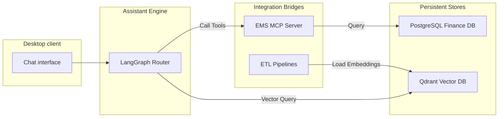

# MCP & Integration

To connect the conversational assistant to structured user data and unstructured documents, Bella Keys provides two distinct integration layers:

---

## Architecture Components

- **Model Context Protocol (MCP) Server**: Exposes database operations as standard JSON-RPC tools. This enables the LLM to read live financial balances and double-entry transaction periods securely.
- **ETL Pipelines**: Standardizes document parsing and text chunking. Converts markdown pages into dense vector embeddings and loads them to a host Qdrant database to fuel semantic search.

---

## Integration Layout

