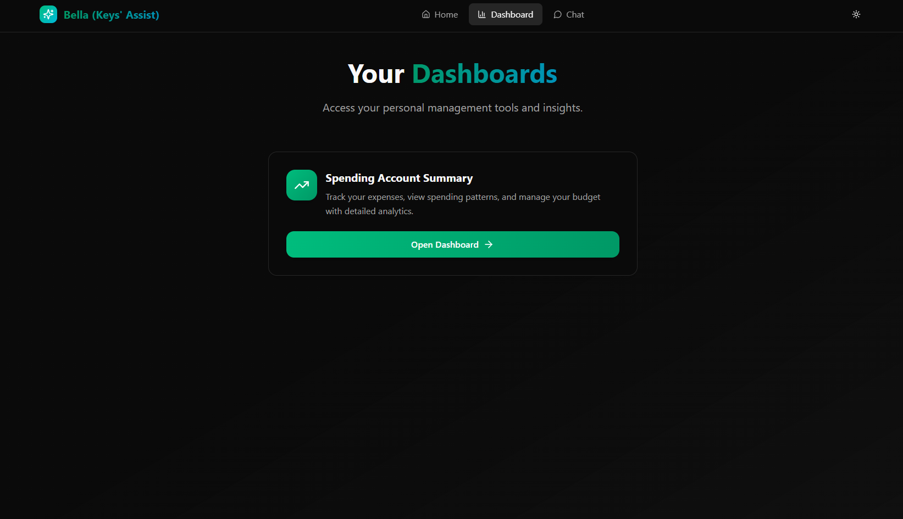
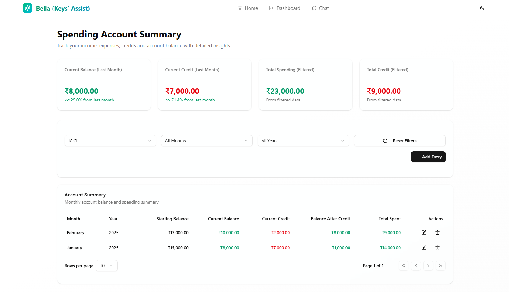
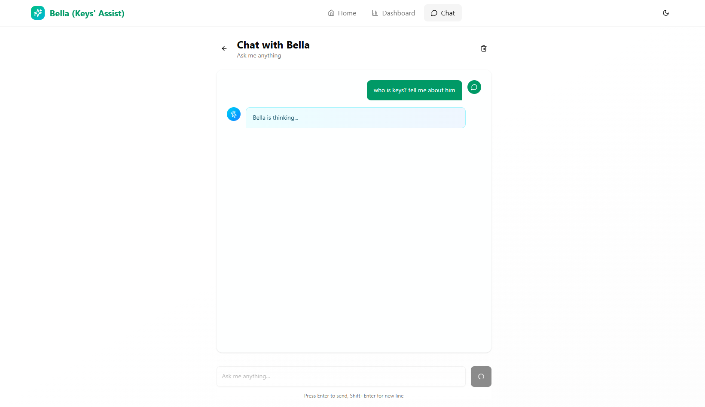
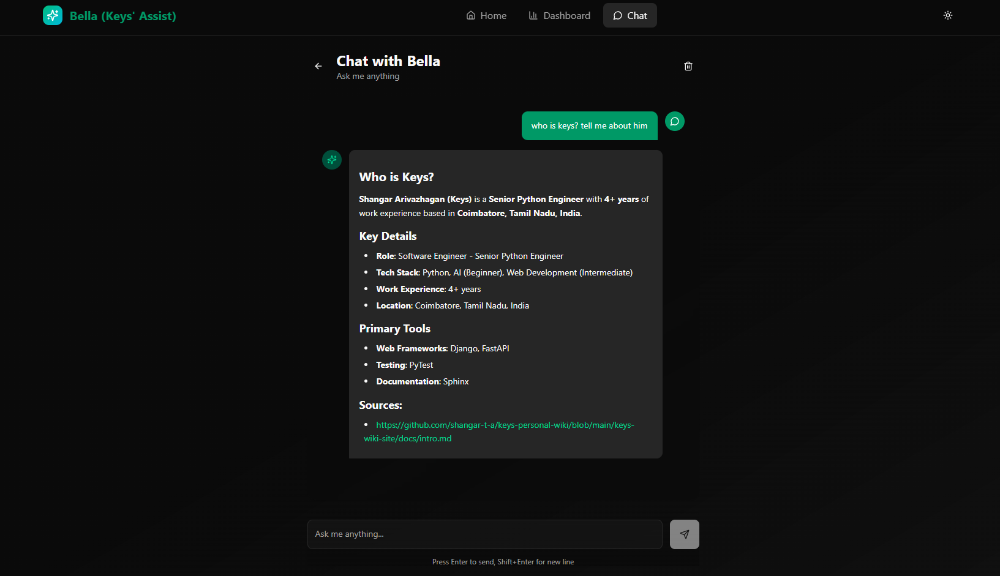
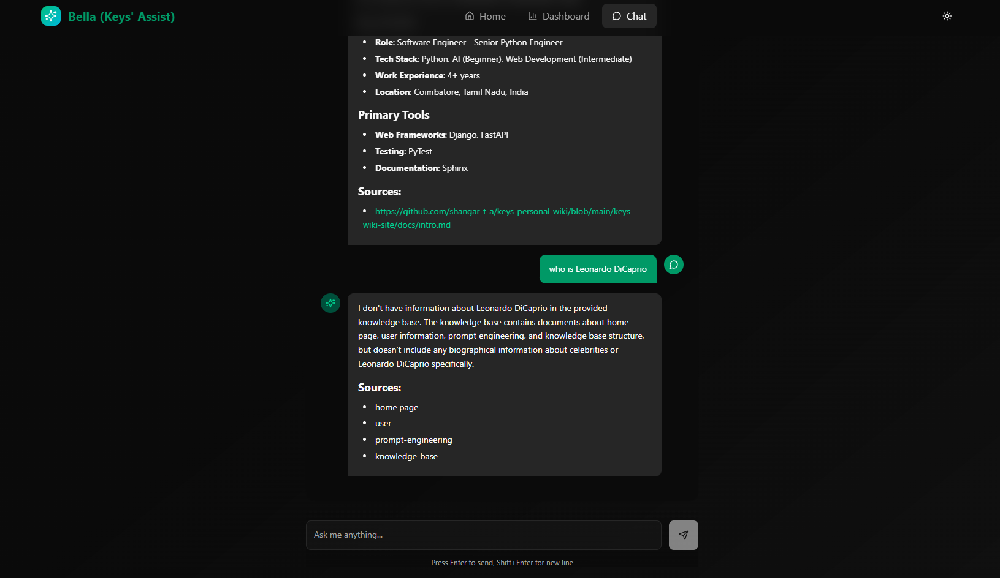

import GradientHeading from '@site/src/components/core/GradientHeading';
import CenteredIntro from '@site/src/components/core/CenteredIntro';
import LeftAlignBody from '@site/src/components/core/LeftAlignBody';

Bella Assist Poster

<GradientHeading
  as="h1"
  gradientFrom="#f1c533ff"
  gradientMid="#f5e97eff"
  gradientTo="#8f860cff"
>
# Bella Assist

</GradientHeading>

<CenteredIntro>
Bella Assist is my personal portfolio project that showcases my skills in designing and developing backend and AI
services. The project also aims to assist me in some of my regular chores. And I nicknamed the project as "Bella"!
</CenteredIntro>

## Bella currently handles

<LeftAlignBody>
1. Expense Manager
   1. Dashboard to track and get insights on monthly expenses
2. Bella ChatBot
   1. Chatbot to perform operations on internal services and fetch information from my sources. Right now Bella Chat
      is a simple RAG bot that can answer questions on my portfolio.
</LeftAlignBody>

## Expense Manager

<LeftAlignBody>

1. Bella Home Page

   

2. Dashboards List

   

3. Spending Account Summary Dashboard

   

</LeftAlignBody>

## Bella ChatBot

<LeftAlignBody>

1. Chat Interface

   

2. Chat Response (Answer Available in RAG)

   

3. Chat Response (Answer Not Available in RAG)

   

</LeftAlignBody>
