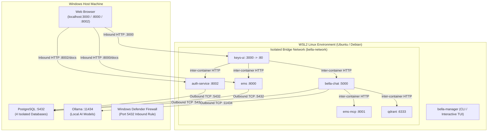
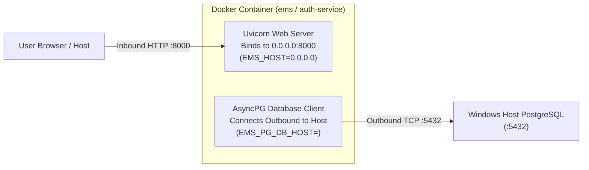
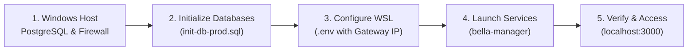
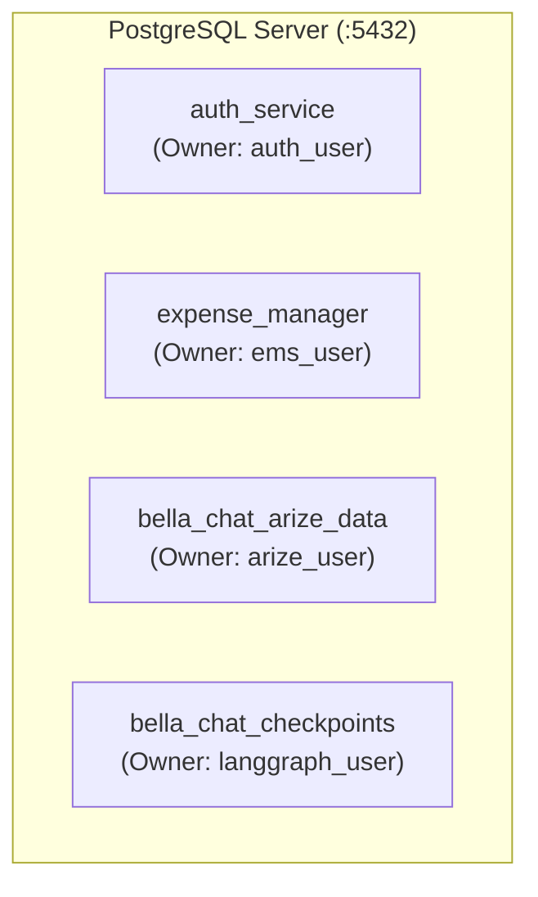

# Production Setup Guide: WSL2, Docker &amp; Windows Host Database

This guide details how to deploy the Bella Keys production environment when running **Docker and `bella-manager` inside WSL2 (Ubuntu/Debian)** with **PostgreSQL (and optionally Ollama) on your Windows host machine**.

---

## 1. Deployment Architecture

Bella Keys utilizes a hybrid **"inside-out" architecture**:

* **Stateless Microservices (WSL2 Docker):** `auth-service`, `ems` (Expense Manager), `bella-chat` (AI Orchestrator), `ems-mcp` (MCP Server), `qdrant` (Vector DB), and `keys-ui` (Web Frontend) run in an isolated bridge network (`bella-network`).
* **Stateful User Data (Windows Host):** PostgreSQL databases (financial records, auth accounts, checkpoints) and local Ollama model inference stay on the host machine for maximum privacy, data sovereignty, and performance.



---

## 2. Inbound Server Bind vs. Outbound Database Connection

A critical architectural distinction when configuring container environment variables:



* **`EMS_HOST=0.0.0.0`:** Instructs the container web server to listen on all container interfaces for incoming HTTP traffic from the host port mapping (`8000:8000`).
* **`EMS_PG_DB_HOST=<GATEWAY_IP>`:** Tells the container database client the exact IP address of the Windows Host machine where PostgreSQL is running.

---

## 3. Prerequisites Checklist

Ensure the following tools are installed and configured:

| Component                       | Location     | Requirement                                                | Configuration Command                              |
| :------------------------------ | :----------- | :--------------------------------------------------------- | :------------------------------------------------- |
| **WSL2**                        | Windows      | Ubuntu 22.04+ or Debian 12+                                | `wsl --status`                                     |
| **Docker Engine &amp; Compose** | WSL2         | Standard Docker CE with Compose plugin                     | `sudo apt install docker-ce docker-compose-plugin` |
| **Non-Root Docker Access**      | WSL2         | User added to `docker` group                               | `sudo usermod -aG docker $USER && newgrp docker`   |
| **`uv` Package Manager**        | WSL2         | Fast Python tool runner                                    | `curl -LsSf https://astral.sh/uv/install.sh \| sh` |
| **PostgreSQL**                  | Windows Host | Version 15+ installed on Windows                           | Service running on port `5432`                     |
| **Git &amp; GitHub CLI**        | WSL2         | Authenticated for private repos                            | `gh auth login && gh auth setup-git`               |
| **Ollama** *(Optional)*         | Windows Host | For local LLM inference ([ollama.com](https://ollama.com)) | Listening on `0.0.0.0:11434`                       |

---

## 4. Setup Sequence



---

## 5. Step 1: Configure Windows Host PostgreSQL

By default, PostgreSQL on Windows only listens on `localhost` (`127.0.0.1`), rejecting connections from the WSL virtual switch.

### 5.1. Enable External Listening in `postgresql.conf`

1. Open `postgresql.conf` on Windows (typically in `C:\Program Files\PostgreSQL\<version>\data\postgresql.conf`).
2. Update the `listen_addresses` directive:
   ```ini
   listen_addresses = '*'
   ```
   *(Ensure any leading `#` comment character is removed).*

### 5.2. Allow WSL Subnet Access in `pg_hba.conf`

1. Open `pg_hba.conf` in the same directory (`C:\Program Files\PostgreSQL\<version>\data\pg_hba.conf`).
2. Add this entry to the bottom of the file:
   ```text
   # Allow WSL2 and Docker container bridge connections
   host    all             all             0.0.0.0/0               scram-sha-256
   ```
   *(If your PostgreSQL uses MD5 passwords, replace `scram-sha-256` with `md5`).*

### 5.3. Restart PostgreSQL &amp; Add Windows Firewall Rule

Open **PowerShell as Administrator on Windows**:

```powershell
# 1. Restart PostgreSQL service
Restart-Service postgresql*

# 2. Add Windows Defender Firewall rule for PostgreSQL port 5432
New-NetFirewallRule -DisplayName "PostgreSQL for WSL" -Direction Inbound -LocalPort 5432 -Protocol TCP -Action Allow
```

### 5.4. Verification

1. **Verify Windows is listening on all interfaces (PowerShell Admin):**
   ```powershell
   Get-NetTCPConnection -LocalPort 5432 | Select-Object LocalAddress, LocalPort, State
   ```
   *Expected Output: `LocalAddress: 0.0.0.0` and `State: Listen`.*

2. **Find your Windows Gateway IP in WSL:**
   ```bash
   ip route show default | awk '{print $3}'
   ```
   *Note the IP address (e.g., `172.19.0.1` or `172.28.160.1`).*

3. **Test connection from WSL:**
   ```bash
   nc -zv <GATEWAY_IP> 5432
   ```
   *Expected Output: `Connection to <GATEWAY_IP> 5432 port [tcp/postgresql] succeeded!`*

> [!NOTE]
> Do not use `10.255.255.254`. That address is WSL2's internal DNS tunneling resolver, not the Windows host TCP interface. Always use the gateway IP from `ip route show default`.

### 5.5. Revert / Rollback

```powershell
# Remove firewall rule
Remove-NetFirewallRule -DisplayName "PostgreSQL for WSL"

# Revert listen_addresses = 'localhost' in postgresql.conf and restart:
Restart-Service postgresql*
```

---

## 6. Step 2: Initialize Production Databases

Bella Keys requires 4 distinct databases and user roles for full service isolation.



### 6.1. Execute Initialization Script

On Windows (PowerShell or pgAdmin), run `scripts/database/init-db-prod.sql`:

```powershell
# In Windows PowerShell:
cd C:\Users\<Username>\sandbox\repos\bella-keys-personal-assist
psql -U postgres -f scripts/database/init-db-prod.sql -v auth_pass="'<AuthPassword>'" -v ems_pass="'<EmsPassword>'" -v arize_pass="'<ArizePassword>'" -v langgraph_pass="'<LangGraphPassword>'"
```

### 6.2. Verification

```powershell
psql -U postgres -c "\l"
```

### 6.3. Revert / Teardown

```sql
-- Run in psql as superuser:
DROP DATABASE IF EXISTS auth_service;
DROP USER IF EXISTS auth_user;

DROP DATABASE IF EXISTS expense_manager;
DROP USER IF EXISTS ems_user;

DROP DATABASE IF EXISTS bella_chat_arize_data;
DROP USER IF EXISTS arize_user;

DROP DATABASE IF EXISTS bella_chat_checkpoints;
DROP USER IF EXISTS langgraph_user;
```

---

## 7. Step 3: Configure Ollama for Local AI (Optional)

If using the `ai-chat` profile with local AI inference:

1. Configure Ollama to listen on all interfaces on Windows (System Environment Variable: `OLLAMA_HOST=0.0.0.0:11434`).
2. Add Firewall rule in Windows PowerShell (Admin):
   ```powershell
   New-NetFirewallRule -DisplayName "Ollama for WSL" -Direction Inbound -LocalPort 11434 -Protocol TCP -Action Allow
   ```
3. Pull required models on Windows:
   ```powershell
   ollama pull nomic-embed-text
   ollama pull qwen2.5:7b
   ```
4. Verify from WSL:
   ```bash
   curl http://<GATEWAY_IP>:11434/api/tags
   ```

---

## 8. Step 4: Configure Environment Variables in WSL

In your WSL deployment directory (e.g., `~/.bella` or repo root):

### 8.1. Create `.env`

```bash
cp docker/.env.prod.example .env
```

### 8.2. Generate Secure JWT Secret

```bash
python3 -c "import secrets; print(secrets.token_urlsafe(32))"
```

### 8.3. Configure `.env` Parameters

Edit `.env` and set `<GATEWAY_IP>` (from `ip route show default | awk '{print $3}'`):

```ini
# ----------- Auth Service ----------------------
JWT_SECRET="<YOUR_GENERATED_JWT_SECRET>"
AUTH_PG_DB_HOST=<GATEWAY_IP>
AUTH_PG_DATABASE_URL=postgresql+asyncpg://auth_user:<AuthPassword>@<GATEWAY_IP>:5432/auth_service

# ----------- Expense Manager Service -----------
EMS_HOST=0.0.0.0
EMS_PORT=8000
EMS_DEBUG=False
EMS_STORAGE_TYPE="postgresql"
EMS_PG_DB_HOST=<GATEWAY_IP>
EMS_PG_DATABASE_URL=postgresql+asyncpg://ems_user:<EmsPassword>@<GATEWAY_IP>:5432/expense_manager

# ------------- Bella Chat Service --------------
SYNTHESIS_MODEL_PROVIDER="google" # or "ollama"
SYNTHESIS_MODEL_NAME="gemini-3.1-flash-lite"
GOOGLE_API_KEY="<YourGoogleApiKeyIfUsingGemini>"

OLLAMA_URL="http://<GATEWAY_IP>:11434"
QDRANT_URL="http://qdrant:6333"

ARIZE_PG_DB_HOST=<GATEWAY_IP>
ARIZE_PG_DB_USER="arize_user"
ARIZE_PG_DB_PASSWORD="<ArizePassword>"
ARIZE_PG_DB_NAME="bella_chat_arize_data"

LANGGRAPH_PG_DB_HOST=<GATEWAY_IP>
LANGGRAPH_PG_DB_USER="langgraph_user"
LANGGRAPH_PG_DB_PASSWORD="<LangGraphPassword>"
LANGGRAPH_PG_DB_NAME="bella_chat_checkpoints"
```

---

## 9. Step 5: Launch Services via `bella-manager`

`bella-manager` is a cross-platform CLI and interactive TUI that manages container lifecycles, configuration synchronization, and `.env` reconciliation.

### 9.1. Install Globally in WSL via `uv tool`

```bash
# Method A: Using GitHub CLI Credential Helper (HTTPS)
gh auth setup-git
uv tool install "git+https://github.com/shangar-t-a/bella-keys-personal-assist#subdirectory=tools/bella-manager"

# Method B: Using SSH
uv tool install "git+ssh://git@github.com/shangar-t-a/bella-keys-personal-assist.git#subdirectory=tools/bella-manager"

# Method C: From Local Windows Checkout
uv tool install /mnt/c/Users/<Username>/sandbox/repos/bella-keys-personal-assist/tools/bella-manager
```

### 9.2. Start Services

```bash
# Launch interactive TUI:
bella-manager

# Or run direct CLI commands:
bella-manager start --profile ems --with-ui    # EMS + Auth + Web UI
bella-manager start --profile ai-chat --with-ui # Full AI Chat + MCP + Web UI

# Check container status:
bella-manager status

# Stream logs:
bella-manager logs -f

# Stop services:
bella-manager stop
```

---

## 10. Step 6: Verify Production Environment

### 10.1. Check Service Health Endpoints

From WSL or Windows PowerShell:

```bash
# Auth Service Health
curl -f http://localhost:8002/health
# Expected: {"status":"ok"}

# Expense Manager Health
curl -f http://localhost:8000/health
# Expected: {"status":"healthy"}

# Bella Chat Health (if ai-chat enabled)
curl -f http://localhost:5000/health
# Expected: {"status":"healthy"}
```

### 10.2. Interactive API Documentation

Open in your Windows browser:
* **Expense Manager Swagger UI:** `http://localhost:8000/docs`
* **Auth Service Swagger UI:** `http://localhost:8002/docs`

### 10.3. Open Web User Interface

Navigate in your Windows browser to:

```text
http://localhost:3000
```

1. Register your initial admin user account.
2. Complete SSO login to receive your secure session token.
3. Access the Expense Manager, Wealth Tracking, and AI Assistant interfaces.

---

## 11. Troubleshooting Matrix

| Symptom                                                                       | Probable Cause                                                                 | Exact Solution                                                                                                                                         |
| :---------------------------------------------------------------------------- | :----------------------------------------------------------------------------- | :----------------------------------------------------------------------------------------------------------------------------------------------------- |
| `Connection refused` on port 5432                                             | Windows PostgreSQL only listening on `localhost`                               | Set `listen_addresses = '*'` in `postgresql.conf`, add `host all all 0.0.0.0/0 scram-sha-256` to `pg_hba.conf`, and run `Restart-Service postgresql*`. |
| `Connection timed out` on port 5432                                           | Windows Defender Firewall blocking WSL virtual switch                          | Add inbound rule: `New-NetFirewallRule -DisplayName "PostgreSQL for WSL" -Direction Inbound -LocalPort 5432 -Protocol TCP -Action Allow`.              |
| `nc: connect to 10.255.255.254 failed: Connection refused`                    | `10.255.255.254` is WSL2's DNS tunneling stub resolver, not the host interface | Run `ip route show default \| awk '{print $3}'` in WSL and use the gateway IP following `via`.                                                         |
| `permission denied while trying to connect to the docker API`                 | Non-root WSL user is not in the `docker` group                                 | Run `sudo usermod -aG docker $USER` then `newgrp docker` in WSL.                                                                                       |
| `could not read Username for 'https://github.com': terminal prompts disabled` | Private repo `uv tool install` missing git credentials                         | Run `gh auth login` followed by `gh auth setup-git` in WSL.                                                                                            |
| `[ERROR] Failed to download docker-compose.prod.yaml`                         | `bella-manager` missing GitHub token for private repo downloads                | Authenticate with `gh auth login`; `bella-manager` automatically reads `gh auth token`.                                                                |
| `ERROR: could not bind on any address out of [('<IP>', 8000)]`                | `EMS_HOST` was set to Gateway IP instead of `0.0.0.0`                          | Set `EMS_HOST=0.0.0.0` (container bind) and `EMS_PG_DB_HOST=<GATEWAY_IP>` (database connection) in `.env`.                                             |
| `password authentication failed for user "ems_user"`                          | Password mismatch between `init-db-prod.sql` and `.env`                        | Ensure password in `EMS_PG_DATABASE_URL` matches the password used during `init-db-prod.sql` execution.                                                |
