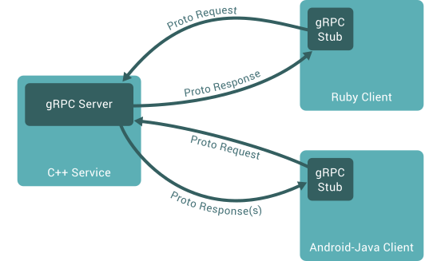

# Python gRPC Guide

- [Python gRPC Guide](#python-grpc-guide)
  - [gRPC Introduction](#grpc-introduction)
  - [gRPC Python](#grpc-python)
    - [Installation](#installation)
    - [Quick Start](#quick-start)

## gRPC Introduction

gRPC stands for Google Remote Procedure Call.

- gRPC is based on HTTP/2 and Protocol.
- gRPC is well suited for microservices architecture where different services are written in different languages.
- gRPC is language agnostic, meaning it can be used with gRPC supported languages.
- gRPC allows to call methods on a remote server as if it were a local object.

Useful Resources:

- [gRPC Official Documentation](https://grpc.io/docs/)
- [gRPC Python Documentation](https://grpc.io/docs/languages/python/)
- [gRPC Python YT Tutorial](https://www.youtube.com/watch?v=WB37L7PjI5k)

Rough Architecture of gRPC:<br>


## gRPC Python

### Installation

Install the required packages for gRPC Python. `grpcio` and `grpcio-tools` are the main packages required for gRPC
Python.

```powershell
pip install grpcio
pip install grpcio-tools

#or using poetry

poetry add grpcio
poetry add grpcio-tools
```

### Quick Start

1. Create and update a sample proto file `greet.proto`. Reference: [greet.proto](../src/protos/greet.proto).
2. Run the following command to generate server and client code from the proto file.

   ```powershell
   python -m grpc_tools.protoc -I <protos_dir> --python_out=<output_dir> --grpc_python_out=<output_dir> <proto_file_dir>
   python -m grpc_tools.protoc -I ../protos --python_out=. --grpc_python_out=. ../protos/greet.proto

   #or using poetry
   poetry run python -m grpc_tools.protoc -I ../protos --python_out=. --grpc_python_out=. ../protos/greet.proto
   ```

3. Verify if the command generated the required files `greet_pb2.py` and `greet_pb2_grpc.py` in the output directory.
4. Basic server implementation. Reference: [greet_server.py](../src/greet_server.py). Some important points:
   - Create a class that inherits from the generated `greet_pb2_grpc.GreeterServicer`. Good practice to name it as
     `GreeterServicer` (same as the service name in the proto file).
   - Implement the methods defined in the proto file.
   - Define a `serve` function that does the following:
     - Create a gRPC server. `grpc.server(futures.ThreadPoolExecutor(max_workers=10))`.
     - Add the created servicer to the server.
       `greet_pb2_grpc.add_GreeterServicer_to_server(GreeterServicer(), server)`.
     - Add insecure port to the server. `server.add_insecure_port("localhost:50051")`.
     - Start the server. `server.start()`.
     - Wait for termination. `server.wait_for_termination()`.
5. Basic client implementation. Reference: [greet_client.py](../src/greet_client.py). Some important points:
   - Create a `run` function that does the following:
     - Create a channel with port from the server. `grpc.insecure_channel("localhost:50051")`. Best practice to use
       `with` statement for the channel.
     - Create a stub. `stub = greet_pb2_grpc.GreeterStub(channel)`.
6. Client Implementation. Reference: [greet_client.py](../src/greet_client.py). Some important points:
   - Client will create a request object defined in the proto file.
   - Call the required server method on the stub with the request object and get the response.
7. Server Implementation. Reference: [greet_server.py](../src/greet_server.py). Some important points:
   - Server will implement the methods defined in the proto file.
   - Create a response object defined in the proto file.
   - Return the response object.
8. High level overview of different types of RPCs:
   1. Unary RPC:
      - Client: Create request -> Call server method -> Get response.
      - Server: Implement server method -> Create response -> Return response.
   2. Server Side Streaming RPC:
      - Client: Create request -> Call server method -> Get multiple responses.
      - Server: Implement server method -> Create and Yield multiple responses.
   3. Client Side Streaming RPC:
      - Client: Create multiple requests (Iterator) -> Call server method -> Get response.
      - Server: Implement server method -> Process multiple requests (Iterator) -> Create response -> Return response.
   4. Bidirectional Streaming RPC:
      - Client: Create multiple requests (Iterator) -> Call server method -> Get multiple responses.
      - Server: Implement server method -> Process multiple requests (Iterator) -> Create and Yield multiple responses.

---
> **Connect with me:**<br>
> [](https://github.com/shangar-t-a)
> [](https://www.linkedin.com/in/shangar-arivazhagan/)<br>
> **Resources:** [🏠 Go to Home](../../../README.md)<br>
> **Navigation:** [⬆️ Go to Top](#python-grpc-guide)
